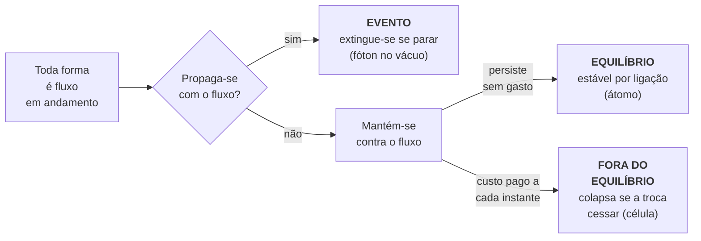
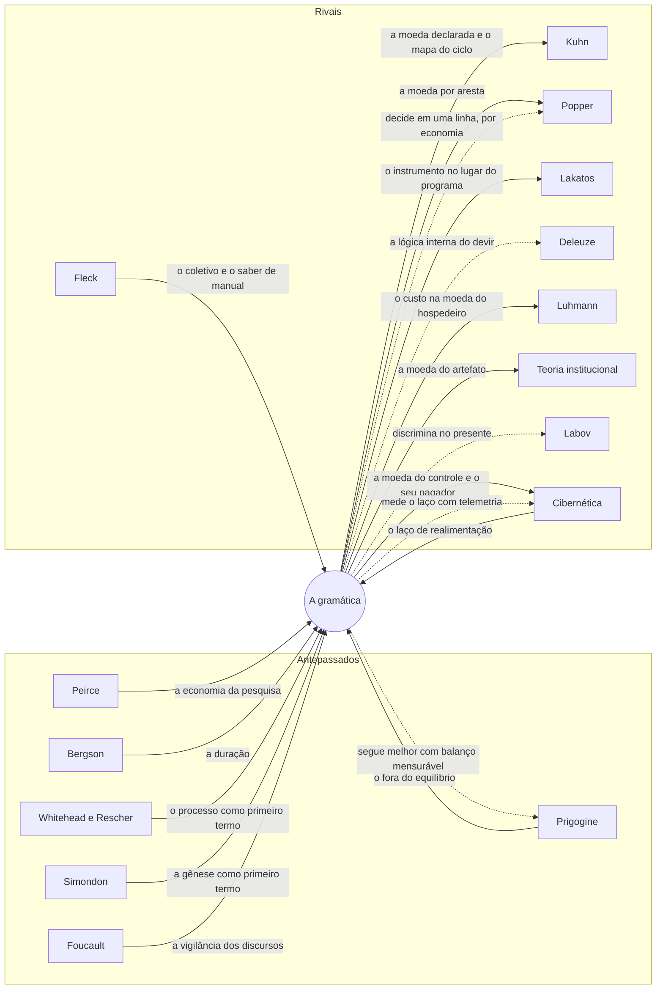
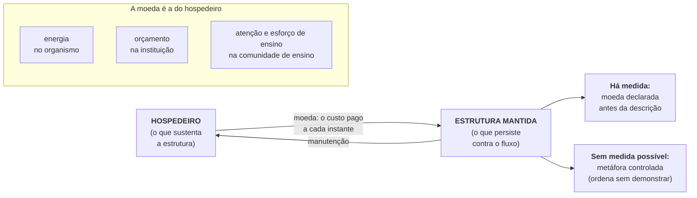
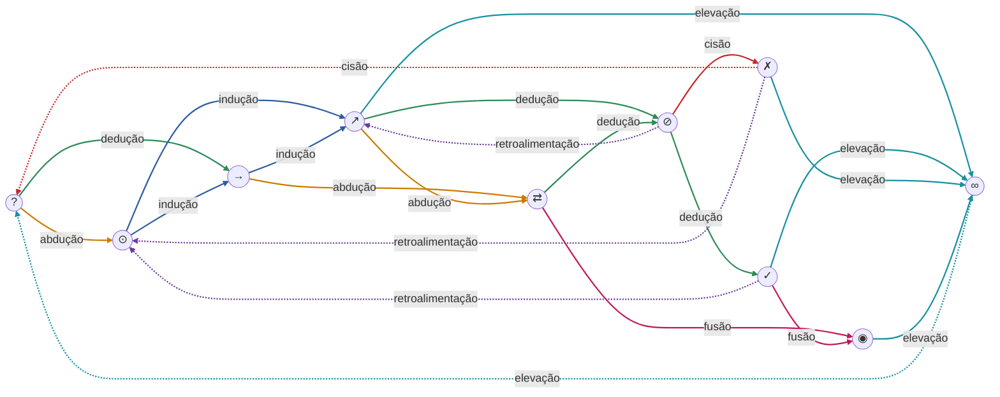
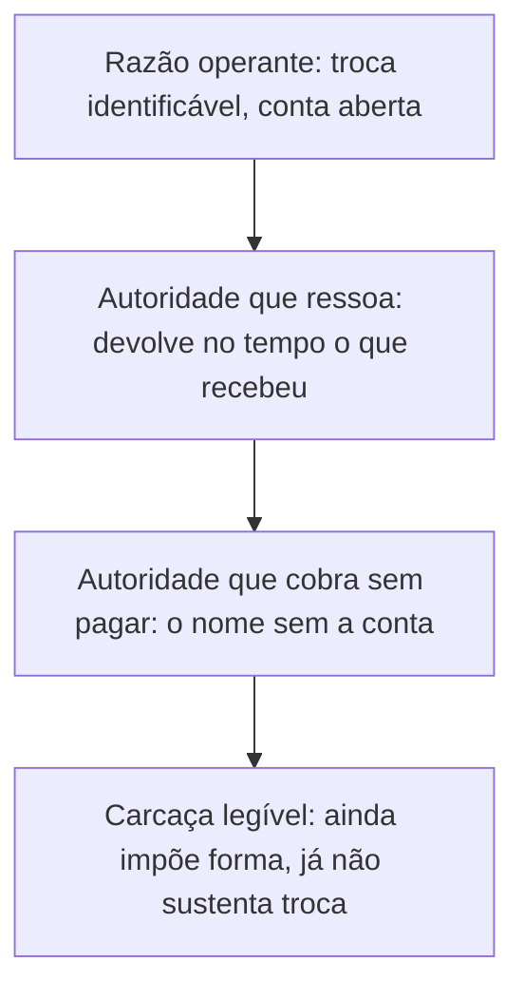

# GRAMÁTICA DO MOVIMENTO

*Autoria: O Besta Fera. 26 de agosto de 2026.*

*Bacharel em Sistemas de Informação, Especialista em Engenharia de Dados, Pesquisador independente em Filosofia da Ciência.*

## RESUMO

Este artigo propõe uma gramática filosófica do movimento, primeiro instrumento da fluxonomia, a disciplina que descreve as formas como recortes de fluxo e cobra em moeda declarada o custo de cada persistência: um sistema de sete perguntas com as quais qualquer fenômeno dentro do escopo declarado se descreve como recorte temporário de um fluxo que o precede e o dissolve. O texto estabelece uma tipologia de formas, evento, estrutura em equilíbrio e estrutura fora do equilíbrio, classificadas sob aspecto declarado de horizonte e moeda, e uma disciplina central, a declaração prévia da moeda em que o custo de cada estrutura é pago, com a categoria de metáfora controlada para os termos sem medida possível. Desse instrumento deriva uma topologia do ciclo do conhecimento, com dez estados epistemológicos e sete movimentos, apresentada como extensão da gramática, e não como seu resultado; cada aplicação declara o que produz, se previsão, ordenação ou ilustração. O escopo reivindicado é o dos domínios epistêmico, linguístico e institucional; sobre a metafísica última e o microfísico, a gramática nada afirma. Reconhece como única agramaticalidade o enunciado que se declara isento de revisão. Trata-se de proposta teórico-metodológica: os exemplos são ilustrações de uso, e a validação empírica constitui programa de pesquisa próprio. O regime de revisão já foi exercido, em cinco validações cegas com aplicadores automáticos independentes e em consolidações cegas do manuscrito, tudo com comparação feita pelo lado do autor, o que o desclassifica como auditoria externa; a repetição com aplicador humano permanece agenda declarada, e o arco das revisões consta do Apêndice E.

**Palavras-chave:** ontologia de processo; epistemologia; topologia do conhecimento; metáfora controlada; filosofia da ciência.

## 1 INTRODUÇÃO

Tudo é movimento. A frase funciona aqui como postulado gramatical, aposta de boa formação, e não como tese empírica sobre o mundo; não se reivindica nova, e o que o texto reivindica como próprio é o protocolo operacional. O nome é gramática porque o sistema fixa regras de boa formação para enunciados sobre o movimento e julga enunciados, não fatos. A disciplina que essas regras abrem recebe nome próprio, declarado uma vez com a vantagem e o preço: fluxonomia, a disciplina que descreve toda forma como recorte de fluxo e cobra, em moeda declarada, o custo de cada persistência; a vantagem é nomear a matéria e o gesto num só termo, o preço é o eco que a palavra fluxo carrega de outros usos. Esta gramática é o seu primeiro instrumento, e a distinção se mantém em todo o texto: fluxonomia é o campo, gramática do movimento é este sistema de regras. A gramática aqui apresentada trata toda forma como recorte temporário de um fluxo que a precede e que um dia a dissolve de volta. Sobre essa intuição, o texto oferece sete perguntas com as quais qualquer fenômeno dentro do escopo declarado pode ser descrito, um procedimento para aplicá-las e o modo como o sistema aceita ser revisto. Os casos trabalhados adiante entram como instâncias de tipos, e não como indivíduos: o que se classifica é sempre a forma sob um aspecto declarado. Dessa aposta deriva a tese do texto: se toda forma se mantém por trocas custeadas, o erro corresponde à troca que falha, a falsidade à aparência de troca sem custo, a farsa à proteção do erro que recusa a revisão. A autenticidade é a conta paga e aberta, e a razão, nesse registro, é o nome da estrutura que continua trocando. Essa tese se anuncia aqui, prepara-se na gramática e assume-se na discussão.

A frase tem genealogia, que aqui se declara. Heráclito pôs o fluxo antes das coisas, e a tradição que transmitiu seus fragmentos já os lia como a tese de que tudo flui; se parte dessa tradição formulou ela mesma os fragmentos que cita, a tese do fluxo é um recorte produzido pela transmissão, caso exemplar do sistema. Aristóteles respondeu com a física do movimento como passagem da potência ao ato e fundou a gramática rival, a das substâncias e das formas; a filologia da disputa consta do Apêndice D. Este texto se filia ao primeiro e disputa com o segundo: aceita o fluxo como primeiro termo e trata a forma como registro de um instante, nunca como termo último. O acréscimo à disputa é o protocolo, as sete perguntas e o modo como aceita ser revisto.

Nenhuma forma tem origem anterior ao fluxo. A pedra, a célula, a instituição e a palavra são movimento em andamento, registrado por um instante como se fosse coisa. A mudança ocorre independentemente de quem a registra; negá-la é fixação que o próprio fluxo se encarrega de revisar.

Entre as formas, algumas se propagam com o fluxo e outras se mantêm contra ele. As primeiras são eventos, como um fóton no vácuo, para o qual o repouso nem sequer é estado fisicamente possível; um evento parado se extingue, porque sua identidade é a continuidade da propagação. O evento puro entra como caso-limite declarado, sem contrapartida termodinâmica cobrada aqui; a conta do custo corre sobre as estruturas. As que se mantêm dividem-se em duas famílias. Há estruturas em equilíbrio, estáveis por ligação num mínimo termodinâmico de energia, como um átomo isolado de isótopo estável no estado fundamental; elas persistem sem gasto, e desfazê-las custa energia ao que as desfaz. E há estruturas fora do equilíbrio, estáveis por manutenção, como uma célula; seu custo é contínuo e precisa ser pago a cada instante, na moeda do que as hospeda. Esta segunda família contém, no domínio físico-químico, as estruturas dissipativas de Prigogine como caso paradigmático; fora dele, a gramática exige que a moeda seja declarada, e essa exigência separa a afirmação de uma metáfora. A Figura 1 resume a classificação, e a Tabela 1 a fixa em conta. A tricotomia reexpressa, de propósito, a taxonomia termodinâmica padrão das formas estáveis, sem se oferecer como novidade; a gramática reivindica o travamento pelo comportamento previsto e a moeda declarada, ausentes da taxonomia clássica.

*Figura 1 – O esquema da tipologia das formas, travada pelo comportamento previsto*

*Fonte: elaboração do autor.*

Uma mesma forma pode ser lida em tipos distintos conforme o aspecto analisado, e o aspecto se fixa antes da classificação: horizonte temporal e moeda da classificação. A classificação se trava pelo comportamento que ela prevê: a estrutura que para de trocar colapsa, o evento que para de se propagar se extingue, o confinamento persiste sem custo. A identidade de uma estrutura é a continuidade de suas trocas, e por isso seu material pode ser substituído por inteiro sem que a forma se perca, como acontece com o corpo que refaz suas células e segue sendo o mesmo. O travamento é assimétrico entre os tipos: a extinção do evento e o colapso da estrutura mantida se observam no acontecimento; a persistência sem gasto só se afere por contrafactual, e a estrutura em equilíbrio é, por isso, a mais cara de testar.

*Tabela 1 – A tipologia das formas, travada pelo comportamento previsto*

| Tipo | Modo de estabilidade | Custo | Comportamento previsto | Exemplo |
|---|---|---|---|---|
| Evento | propagação com o fluxo | nenhum após o disparo | parado, se extingue | fóton no vácuo; um raio |
| Estrutura em equilíbrio | ligação num mínimo termodinâmico de energia | pago na formação | persiste sem gasto; desfazê-la custa a quem a desfaz | átomo isolado de isótopo estável |
| Estrutura fora do equilíbrio | manutenção por troca | contínuo, na moeda do hospedeiro | cessada a troca, colapsa | célula; instituição; conceito |

*Fonte: elaboração do autor.*

## 2 REFERENCIAL TEÓRICO

A gramática tem parentes, e nomeá-los é o primeiro custo desta seção. Para cada um, três relações: o que a gramática recebe, o que ela acrescenta e onde o rival segue melhor. Os registros da palavra movimento, o conflitante, o neutro e o componente, e as quatro lacunas do mapa, com seus autores e seus destinos aqui, constam do Apêndice D; o que segue percorre os rivais. A ordem: primeiro os antepassados do fluxo e da economia do custo, de Whitehead, Rescher e Peirce a Simondon e Deleuze; depois os físicos e os teóricos da estrutura mantida, de Schrödinger e Prigogine à autopoese, a Luhmann e a Wiener; em seguida os cartógrafos do ciclo do conhecimento, de Bachelard a Fleck, Kuhn e Popper, com a teoria institucional e a ordem do discurso coladas conforme o parentesco pede; por fim as teorias do custo medido e dos ciclos formais, de Simon e Lakatos a Bertalanffy e à ontologia processual da biologia.

Ontologia de processo (Whitehead, 1925; 1929). A dependência é a primazia do devir sobre a substância, recebida inteira. Registra-se um segundo parentesco, específico: a falácia da concreção deslocada, o erro de tomar a abstração pelo concreto, é o antepassado direto da cláusula das camadas da seção 3.2; o acréscimo daqui é o mecanismo, a travessia de camadas como câmbio oculto, e o destino, a farsa como recusa datada de revisão, e não como erro ontológico. A diferença está em duas disciplinas ausentes na cosmologia de Whitehead: a moeda declarada antes da descrição e a classificação travada por comportamento previsto. O limite mora no domínio metafísico puro, onde nenhuma moeda é mensurável e Whitehead segue melhor: a gramática registra a propagação do evento sem dizer o que ele apreende de outro, experiência imediata que o rival analisa como preensão. A tradição whiteheadiana posterior fica fora desta cartografia por declaração de escopo.

Cartografia da ontologia de processo e economia cognitiva (Rescher, 2000; 1989). O parente que deu à tradição o nome de programa: Rescher cartografou a ontologia de processo como campo de pesquisa e, na dimensão econômica, sistematizou custos, benefícios e riscos da investigação, ampliando a lição de Peirce. A gramática recebe a pergunta pelo custo e a desloca para a moeda declarada por transformação, aresta a aresta, onde o rival contabiliza a pesquisa como um todo. O limite é duplo: o estado da arte do campo, que nenhum sistema sozinho cartografa, e a teoria geral do uso custo-efetivo dos recursos intelectuais ficam com o rival.

Economia da pesquisa (Peirce, 1879; 1901). O antepassado de toda a linhagem do custo declarado: Peirce tratou a lógica da ciência como economia e pediu que o custo de cada investigação, em dinheiro, tempo e energia, fosse pesado antes dela. A gramática recebe a exigência e a desloca para a moeda por aresta. Registra-se o parentesco não explorado: o signo peirciano, mantido como hábito, é vizinho do conceito mantido por atenção, e a semiótica que o estuda não entra neste mapa. O cálculo do valor do conhecimento fica com o rival; a gramática declara o custo sem calculá-lo.

Teoria geral do processo (Seibt, 2009; 2018). A rival sistemática mais próxima: também recusa a cosmologia whiteheadiana e também oferece uma tipologia de processos, classificada em cinco dimensões, com mereologia própria e sem sujeito subjacente. A gramática difere pela moeda declarada, pelo travamento por comportamento previsto e pela topologia do ciclo do conhecimento; a individuação formal dos processos, que esta gramática não possui, fica com a rival.

Linhagem analítica da ontologia de processo (Sellars, 1981; Seibt, 2023). A cartografia desta seção declara seu limite: há um núcleo analítico do processualismo, dos processos sem sujeito de Sellars à literatura sobre processos e eventos, que aqui não se percorrem, e que o verbete da Stanford Encyclopedia of Philosophy já cartografou; a individuação analítica dos processos, com a literatura que a acompanha, fica com o rival.

Duração (Bergson, 1889; 1903; 1907). O antepassado mais velho da casa: a duração já punha o fluxo antes das formas e tratava o recorte como operação do intelecto sobre o contínuo. A gramática traz o que Bergson não ofereceu, a disciplina operacional sobre os recortes; a temporalidade vivida, que nenhuma moeda desta gramática alcança, permanece território do rival.

Individuação (Simondon, 2005, obra redigida em 1958). A individuação a partir de um campo metastável é a parente mais próxima da forma como recorte do fluxo: Simondon também recusa a forma pronta e faz do processo o primeiro termo. A gramática recebe a gênese como primeiro termo e acrescenta a moeda declarada e o mapa do ciclo do conhecimento. O limite é o da gênese das formas, que o rival descreve em operação, não em resultado.

Diferença e repetição (Deleuze, 1968; Deleuze e Guattari, 1980). O contemporâneo mais próximo da primeira pergunta: a diferença anterior à identidade e o rizoma anterior à árvore fazem do fluxo o primeiro termo, como aqui. A gramática acrescenta a moeda declarada, a classificação travada por comportamento previsto e o mapa do ciclo do conhecimento. Derrota declarada, porque acrescenta informação: Deleuze deu ao devir uma lógica interna, a da diferença em si; a gramática classifica recortes do fluxo sem explicar como o inédito emerge dele. A tensão restante está no gesto de enumerar: no sentido deleuziano, contar trajetórias decalca o mapa sem refazê-lo, e declarar a enumeração convenção revisável não apaga a diferença de gesto. Deleuze multiplica caminhos; a gramática os conta.

O que é a vida? (Schrödinger, 1944). O antepassado físico da estrutura mantida: o organismo se conserva extraindo ordem do ambiente, e o autor conjecturou que paga sua persistência em entropia negativa, expressão que ele próprio depois qualificou, preferindo falar em energia livre. A gramática generaliza o pagamento para fora do domínio vivo, com a moeda declarada antes da descrição; o custo termodinâmico da vida, formulado antes de as estruturas dissipativas terem nome, pertence ao rival.

Estruturas dissipativas (Nicolis e Prigogine, 1977; Prigogine e Stengers, 1984). A família fora do equilíbrio as contém como caso paradigmático, sem coincidir com elas, pois há sistemas mantidos fora do equilíbrio que não chegam a bifurcar; o rival dispõe de formulação matemática e confirmação laboratorial e segue melhor em todo domínio com balanço termodinâmico mensurável. A gramática opera nos domínios epistêmico, linguístico e institucional, onde a moeda existe sem equação de estado, e sua obrigação, cumprida na seção 3.2, é declará-la sem disfarce. A vitória do rival é por número: ele prediz limiares de bifurcação, como o valor crítico do número de Rayleigh na convecção de Rayleigh-Bénard, calculado em 1916 e reinterpretado pela escola de Bruxelas como paradigma de estrutura dissipativa; a gramática apenas redescreve a transição depois que ela ocorreu.

Autopoese (Maturana e Varela, 1980). A identidade pela continuidade das trocas é parente direta da identidade pela continuidade da produção de componentes. A gramática generaliza: a troca inclui extração e competição, que a autopoese não cobre, e vale para formas não vivas, como instituições e conceitos. No biológico celular, a palavra fica com o rival.

Teoria dos sistemas sociais (Luhmann, 1984, tradução inglesa 1995). Luhmann descreve a comunicação como a operação autopoiética do sistema social operacionalmente fechado. A gramática acrescenta a variável que Luhmann não mede, o custo pago na moeda do hospedeiro. Na diferenciação interna dos sistemas sociais, o rival segue insuperado.

Cibernética (Wiener, 1948). A cibernética nomeou o gesto do controle pelo laço: comunicação e realimentação como operações comuns ao animal e à máquina, e a plataforma digital contemporânea é esse gesto em escala industrial, a estrutura que hospeda o fluxo da atenção alheia e o tarifa. A gramática recebe o laço, que na topologia da seção 4 corre como retroalimentação, e acrescenta a pergunta que o mecanismo não faz: em que moeda o controle se paga, quem a paga e o que acontece com a estrutura quando o pagamento cessa; lida neste instrumento, a plataforma de atenção é estrutura fora do equilíbrio mantida por moeda raramente declarada, o câmbio oculto que a terceira regra veda operando à vista de todos. No domínio do laço mensurável, com telemetria e instrumentação, o rival segue melhor.

Obstáculo epistemológico (Bachelard, 1938). A ruptura com o senso comum como condição do conhecimento cartografou, antes de Kuhn, o território da crise, e a teoria dos obstáculos descreve por dentro o que resiste à passagem. A gramática recebe a ruptura e acrescenta a moeda declarada em cada aresta e a continuação do ciclo depois dela, trecho que Bachelard não acompanha; a formação do espírito científico, acompanhada na história concreta da física e da química, fica com o rival.

Teoria institucional (Meyer e Rowan, 1977; DiMaggio e Powell, 1983). Cobre a persistência das estruturas organizacionais por legitimidade: a organização adota formas cerimoniais desacopladas da produção e os campos convergem por isomorfismo, com a desinstitucionalização cartografada em literatura própria (Oliver, 1992). A gramática acrescenta a moeda declarada que sustenta o artefato, não a organização. O confronto está percorrido no caso da seção 5.3, com a derrota registrada no mesmo lugar: quem adota a forma e por quê, o rival explica pela pressão do campo; a gramática mede o custo sem explicar a adoção.

Coletivos de pensamento (Fleck, 1935, tradução inglesa 1979). A gênese do fato científico como obra de um coletivo, que circula entre o círculo esotérico e o exotérico, antecede em uma geração a cartografia de Kuhn e cobre quase por inteiro o trecho da topologia que vai da controvérsia à ruptura. A gramática recebe o coletivo e acrescenta a moeda declarada e a precificação do esquecimento, que o saber de manual de Fleck descreve sem contabilizar. A vida interna do coletivo, com um caso documentado, o da reação de Wassermann, é território do rival.

Estrutura das revoluções científicas (Kuhn, 1962). O parente que o mapa não podia omitir, na leitura corrente da edição de 1962: o trecho da topologia que vai da anomalia à ruptura percorre território que Kuhn cartografou primeiro, e o Kuhn tardio reformulou a revolução como troca de léxico. A contagem dos funerais chegou a esse trecho pela mediação dele (Azoulay, Fons-Rosen e Graff Zivin, 2019). A gramática acrescenta a moeda declarada em cada aresta e a precificação do esquecimento: Kuhn já descreveu o esquecimento institucional como a invisibilidade das revoluções; a moeda, não o fenômeno, é o acréscimo. Os dois mapas divergem do de Fleck: o coletivo de pensamento flui e o paradigma endurece, e a tensão permanece aberta, registrada sem arbitragem. A dinâmica interna das comunidades científicas fica com o rival.

Falseabilidade (Popper, 1959, edição original 1934). Popper separou ciência de metafísica com uma regra anterior a qualquer vocabulário: uma teoria é científica quando declara o que a refutaria. O escopo do critério é o das teorias universais, que proíbem eventos; um instrumento de classificação não proíbe evento nenhum e se julga por outro critério, o da clareza, da fecundidade e da parcimônia. Esta gramática não compete com o critério de demarcação; reconhece na regra a mesma disciplina que adota por conta própria, declarar antes e não ajustar depois. A prestação de contas corre caso a caso: cada aplicação em moeda mensurável emite previsões condicionais falseáveis, e a estrutura que persistir sem troca identificável derruba a cláusula de identificação no caso; cada aplicação em metáfora controlada emite ordenações revisáveis, que não entram no critério popperiano e não se apresentam como se entrassem. A derrota é de economia: a regra de Popper decide em uma linha o que aqui custou seções.

Teoria da reprodução (Bourdieu e Passeron, 1970). Descreve o cânone como instrumento de reprodução social. A gramática acrescenta uma medida que a teoria não contém, a taxa de renovação do cânone como termômetro da exclusão do que ainda não tem clássicos; os mecanismos de legitimidade e poder ficam com o rival.

Ordem do discurso (Foucault, 1971). Descreve os procedimentos pelos quais toda sociedade controla a produção do discurso, da exclusão à rarefação. Acrescentam-se o custo pago na moeda do hospedeiro e a observação de que a forma enfraquece quando a troca cessa; os mecanismos de exclusão, acompanhados na história concreta das instituições de palavra, ficam com o rival.

Economia da atenção (Simon, 1971). A moeda em que conceitos e instituições pagam seu custo foi medida por Simon antes de ser nomeada aqui: a riqueza de informação cria a pobreza da atenção (Simon, 1971, p. 40-41), e toda organização administra esse déficit. A gramática generaliza a lição para as outras moedas do mapa, do orçamento à energia; o desenho das organizações, derivado do balanço entre informação e atenção, fica com o rival.

Programas de pesquisa (Lakatos, 1970; 1978). O parente que ensinou à tradição a pergunta pelo destino: um vocabulário vale pelo que permite dizer de novo, e degenera quando apenas redescreve. A gramática aceita a pergunta e declara sua posição: ainda não acumulou derivações e se apresenta como instrumento, não como programa. Se acumular usos que discriminem o que os rivais não discriminam, terá respondido; se apenas redescrever, o critério de Lakatos a dissolve por desuso, e os instrumentos morrem de desuso, não de refutação. A dinâmica das teorias maduras, com núcleo, cinturão e heurística documentados na história da física, fica com o rival.

Ciclos do conhecimento (Popper, 1972; Nonaka e Takeuchi, 1995; Wiig, 1993). O ciclo do conhecimento como grafo ou espiral tem cartografia própria: o esquema tetrádico de Popper, do problema à teoria tentativa, à eliminação de erros e ao problema novo, e os ciclos organizacionais da gestão do conhecimento, de uso difundido sem validação formal; a operação destes ciclos em organizações reais, documentada pela literatura da gestão, fica com o rival. Entram nesta proposta a bifurcação com contagem enumerada, a moeda declarada por aresta e a regra de manutenção aberta. O ganho sobre os dois cartógrafos se diz em uma linha cada: o esquema de Popper tem uma única rota obrigatória e nenhuma transição custeada, de modo que não separa o processo que pagou cada passagem do que a encenou; o coletivo de Fleck descreve a circulação sem preço por aresta, de modo que não registra quando ela deixou de ser paga. A pergunta que nenhum dos dois responde, e que o mapa da seção 4 responde por construção, é quantas rotas legítimas ligam a interrogação a ela mesma sem repetir estado, e em que moeda cada uma se pagou.

Teoria geral dos sistemas (Bertalanffy, 1968). Cobre o domínio biológico-organizacional com pretensão semelhante de generalidade. A gramática difere por declarar os limites do que descreve; Bertalanffy discrimina melhor os sistemas abertos com fronteiras materiais.

Ontologia processual da biologia (Dupré e Nicholson, 2018). O rival vivo do domínio biológico: o programa descreve o organismo, no Manifesto editorial e nos estudos do volume, como processo estabilizado em múltiplas escalas, e a ponte entre a autopoese celular e o processualismo do organismo já tem literatura própria (Meincke, 2019), que esta gramática assume sem reconstruir. A gramática acrescenta a moeda declarada e a topologia do ciclo do conhecimento; o organismo como processo mantido em cada escala, do metabolismo ao ecossistema, pertence ao rival; a gramática assume apenas a passagem do biológico ao epistêmico, onde a moeda muda de natureza.

Nenhum destes rivais, incluída a tipologia formal de Seibt e os ciclos do conhecimento de Popper e da gestão, derivou a topologia do ciclo com moeda declarada por aresta; a reivindicação de novidade recai sobre o travamento por comportamento previsto e sobre a moeda por transformação, não sobre a ideia de ciclo. O acréscimo sobre os dois cartógrafos do ciclo, Fleck e Kuhn, está percorrido no exemplo da seção 5.1. Fica fora desta cartografia, por declaração de escopo, a literatura formal e computacional de modelos do processo de pesquisa, dos modelos de descoberta e coerência de Thagard (1988; 1989) às paisagens epistêmicas de Grim et al. (2013) e Zollman (2010). A verificação dirigida se resume: nenhum dos modelos consultados enumera trajetórias com custo declarado por aresta, na acepção aqui fixada. Se algum o fizer, a reivindicação de novidade cai no ponto, e o confronto se fará então em comum medida; o que nenhum mapa futuro retira deste é o regime que o reabre a cada uso, porque mapa nenhum carrega o próprio caderno.

A economia das trocas com a tradição se enxerga de uma vez na cartografia:

*Figura 2 – A cartografia de rivais: o que a gramática recebe, o que acrescenta e onde segue melhor o rival*

*Setas cheias apontam o que se recebe ou se acrescenta; setas tracejadas apontam onde o rival segue melhor. Fonte: elaboração do autor.*

## 3 A GRAMÁTICA

### 3.1 As sete perguntas

As sete perguntas são o postulado da abertura posto em exercício: se tudo é movimento, descrever é interrogar o fluxo, e cada pergunta é um modo de o postulado pagar sua conta num caso.

**1. O que é?**

A pergunta classifica o caso segundo a tipologia da introdução. A resposta escolhe entre evento, estrutura em equilíbrio e estrutura fora do equilíbrio e registra o comportamento previsto. Um raio se extingue quando para; uma célula colapsa quando cessa a troca. A escolha do horizonte é do aplicador e não se justifica pelo comportamento que a classificação prevê; justificar o horizonte pelo que ele faz prever é círculo, e o círculo está proibido. Estatuto desigual dos três tipos: a persistência sem gasto só se afere por contrafactual, de modo que a estrutura em equilíbrio opera aqui sobretudo como classe de contraste, o limite contra o qual o custo dos outros dois tipos se deixa ver, e toda disputa de classificação que a envolva cai no limite de resolução permanente da seção 3.5.

**2. O que alcança quem observa?**

A percepção é interna ao fluxo que percebe. Toda expectativa foi produzida pela história de trocas do observador e de sua linhagem, e assim observadores distintos convergem quando trocam com o mesmo fluxo; a percepção interna tem fundamento no próprio fluxo, sem acesso a nada fora dele. Essa leitura é o postulado da abertura aplicado à percepção, assumido como boa formação desde a introdução. O observador inclui os instrumentos que mantém: um astrônomo e seu telescópio formam uma estrutura única, e o limiar do instrumento é o limiar dele. O postulado que essa leitura carrega: estrutura estável é, para este instrumento, movimento em ritmo inferior ao limiar do observador; fora do caso instrumental, ritmo e limiar ordenam sem medir.

**3. Como é nomeado?**

Nomear é uma operação de fixação. Toda fixação fica exposta à revisão, feita por quem usa o nome, nas ocasiões que os fluxos ao redor fornecem. Há fixações que morrem sem revisão, junto com os usos que as sustentavam. Nenhuma denominação é definitiva, inclusive as deste vocabulário. A química herdou o nome da alquimia e substituiu o conteúdo; o uso fez a revisão.

**4. O que nele persiste, e a que custo?**

A pergunta desloca a descrição da aparência da forma para sua manutenção. Em estruturas fora do equilíbrio, persistir custa trabalho contínuo, pago pelo hospedeiro. A moeda, seu estatuto e seus limites são definidos na seção 3.2.

**5. O que ele troca?**

Nenhuma estrutura fora do equilíbrio se sustenta em isolamento. Toda estabilidade mantida é resultado de trocas. A troca é o gênero, e cooperação, competição e extração são seus modos; nenhum deles exige simetria. Predador e presa trocam. Duas empresas que disputam um mercado trocam.

Esta pergunta carrega duas cláusulas distintas. A cláusula definicional fixa o vocabulário, pois estrutura fora do equilíbrio é aquela mantida por troca. A cláusula de identificação carrega o risco, pois a troca precisa ser identificável independentemente da persistência: quem a procura deve poder encontrá-la sem saber de antemão se a estrutura persistiu. Uma estrutura que persiste sem troca identificável por esse critério derruba a cláusula de identificação no caso em questão, e a definição não pode ser usada para absorver o caso. Em notação de trava, com E a estrutura, M o mapa das moedas declaradas e τ a troca: persiste(E) ⟺ existe τ identificável que sustenta E, paga em moeda de M; a persistência observada sem τ identificável falsifica a cláusula no caso. A exigência aceita, sem resolver, o problema de Duhem: a identificação da troca depende dos instrumentos de quem procura, e um aplicador zeloso sempre pode alegar uma troca sutil não observada; o remédio declarado é a regra da etiqueta mais fraca da seção 3.2, não a cura. O resíduo se confessa aqui, como limite do instrumento: o remédio decide entre leituras já levantadas, não fabrica a troca que nenhum aplicador viu, e a cláusula depende, nesse ponto, da boa-fé de quem aplica; gramática que prometesse mais estaria encenando objetividade. A presente pergunta foi emendada na seção 6.1, que registra o teor.

**6. Em que escala é medido?**

Toda magnitude é relativa à régua de observação. Ampliar a escala reduz a magnitude aparente da parte e revela a do conjunto; reduzir faz o inverso. O fluxo não depende da régua, mas as formas recortadas dele nem sempre. Há formas que a mudança de régua dissolve: ampliadas, viram preceito; reduzidas, viram ruído. Nesses casos a escala deixa de medir o fenômeno e passa a decidir se ele existe. Há ainda formas transescalares, que existem em várias escalas ao mesmo tempo e não se deixam capturar por nenhuma por completo; nelas, cada régua revela uma face, e nenhuma revela a forma. Um boato é desprezível na escala de uma aldeia e constitui uma crise na escala de uma rede.

**7. Para onde reflui?**

Toda estrutura se dissolve no fluxo que a sustentava, e toda forma reintegra o movimento de que é recorte. A dissolução é a aposta do sistema, declarada e revisável como qualquer fixação: nenhuma forma se mostrou eterna até aqui; o recomeço é local e contingente, e nenhum retorno o promete. Para estruturas capazes de registro, aderir à mudança é facultativo; a mudança ocorre com ou sem a adesão. A dissolução pode ser singular ou em cascata, quando uma estrutura arrasta a seguinte; cada elo é dissolução local, e o conjunto é padrão emergente. Uma civilização se dissolve no fluxo material que a sustentava, e nada garante a próxima.

### 3.2 As moedas e a metáfora controlada

*Figura 3 – O pagamento do custo na moeda do hospedeiro*

*Fonte: elaboração do autor.*

A Figura 3 esquematiza o pagamento. Nela, o hospedeiro sustenta a estrutura mantida pela moeda, o custo pago a cada instante, e recebe dela a manutenção; a estrutura se bifurca conforme a medida: havendo medida, a moeda é declarada antes da descrição; não havendo, o termo recebe a etiqueta de metáfora controlada. A Tabela 2 fixa as quatorze moedas do mapa e o estatuto de sua medida. Moedas vizinhas, como as do ensino e da instituição, distinguem-se pelo hospedeiro que as paga e pelo elemento da topologia cujo comportamento previsto sustentam; a fronteira entre elas é pragmática, declarada em cada aplicação, e vale enquanto discriminar o caso. Disputa entre aplicadores sobre qual hospedeiro paga a moeda se resolve como a cláusula de identificação da quinta pergunta: pela observação separadora da retirada, que mostra de qual retirada a estrutura colapsa. A escolha do vocabulário se declara uma vez, com a vantagem e o preço. Moeda, e não recurso ou condição de manutenção, porque a palavra obriga as duas perguntas que as outras deixam escapar: quem paga, e em que unidade se conta o pagamento; recurso naturaliza o dispêndio, condição o esconde. O preço é a atração economicista, a tentação de ler taxa de câmbio onde não há medida comum; a quinta regra existe para cobrar esse preço a cada uso. Nem todo nome abstrato é moeda, e o critério de admissão: uma moeda é admissível quando é um recurso que o hospedeiro dispende e cuja retirada tem consequência observável distinta. Candidato que falhe no teste entra como metáfora controlada, não como moeda: o prestígio, invocado sem dispêndio identificável do hospedeiro, classifica posições sem sustentar descrição.

*Tabela 2 – As quatorze moedas do mapa e o estatuto de sua medida*

| Moeda | Hospedeiro | Medida | Estatuto |
|---|---|---|---|
| Energia | organismo | mensurável, no balanço termodinâmico | sustenta a descrição |
| Orçamento | instituição | mensurável, na contabilidade do órgão | sustenta a descrição |
| Trabalho experimental | coletivo de pesquisa | contável | sustenta a descrição |
| Esforço editorial e burocrático | revista, comissão ou órgão | contável | sustenta a descrição |
| Conservação física | estrutura material | mensurável | sustenta a descrição |
| Tempo de bancada | laboratório | contável | sustenta a descrição |
| Atenção do ensino | comunidade de ensino | medida difícil, por proxy declarado | sustenta a descrição com cautela |
| Atenção dos falantes | comunidade de falantes | medida difícil, por proxy declarado | sustenta a descrição com cautela |
| Atenção dos editores | comunidade de editores | medida difícil, por proxy declarado | sustenta a descrição com cautela |
| Atenção da autoaplicação | autor | medida difícil, por proxy declarado | sustenta a descrição com cautela |
| Atenção do coletivo de pesquisa | comunidade de pesquisa | medida difícil, por proxy declarado | sustenta a descrição com cautela |
| Reconhecimento | carreira científica | sem medida possível, plano no Apêndice C | metáfora controlada: ordena, não prova |
| Reputação da cisão | quem sustenta a tese nova | sem medida possível, plano no Apêndice C | metáfora controlada: ordena, não prova |
| Arrogância da recusa | posição epistêmica | sem medida possível | metáfora controlada: ordena, não prova |

*Nota: as moedas se combinam e se desdobram por fase em casos particulares, sem moeda nova, conforme os registros datados das seções 5.1 e 5.3. Fonte: elaboração do autor.*

A vulnerabilidade central do sistema é a oscilação entre o literal e o metafórico. Esta parte a fecha. A categoria criada para isso é a metáfora controlada, um termo sem medida possível, declarado como tal, restrito à classificação e impedido de sustentar conclusões. A categoria tem antepassados declaráveis, que ficam fora da cartografia da seção 2 por declaração de escopo, registrada aqui: Hesse (1963) deu às analogias científicas o estatuto de modelo, com analogia positiva, negativa e neutra, e Boyd (1979) mostrou que há metáforas constitutivas de teoria, sem as quais certas formulações não se enunciam. A metáfora controlada difere de ambos os casos por estatuto inferencial: não é modelo nem constituinte de teoria, e nenhuma inferência se licencia dela; é termo de ordenação com etiqueta declarada, admitido para classificar e banido de provar. A fronteira com a analogia neutra de Hesse, de uma vez: a analogia neutra também ordena sem provar, e a categoria aqui criada não a nega. O que a etiqueta adiciona, e a analogia neutra não pede, é o plano de mensurabilidade da quinta regra e a conta pública da proporção; é nesse acréscimo, e não na ordenação, que a metáfora controlada se separa do antepassado. Como uso legítimo, pode-se classificar a recusa de ignorância como cara, sem medi-la, para ordenar posições. Como uso proibido, seria invocar a arrogância da recusa como evidência a favor do sistema.

Antes da descrição, declara-se a moeda e sua medida. Havendo medida, ela sustenta a descrição; não havendo, o termo recebe a etiqueta de metáfora controlada. Em disputa, vale a etiqueta mais fraca, e cabe a quem alega medida exibi-la. A regra tem parentesco com o pré-registro de hipóteses e análises (Simmons, Nelson e Simonsohn, 2011): ali se travam hipóteses antes dos dados; aqui se travam moedas antes da descrição.

A disciplina da moeda impõe cinco regras. Primeira, nenhuma moeda se converte em outra; a gramática não tem taxa de câmbio, e qualquer derivação que some custos em moedas distintas é inválida.

Segunda, onde a medida falhar de modo sistemático, cabe a quem usa o sistema tratar o trecho correspondente da topologia como ilustração, não como derivação.

Terceira, nenhuma derivação pode invocar moeda não declarada; se a derivação exigir uma aferição sem correspondência possível, a derivação está errada, e quem a redigiu a revisa antes de apresentá-la. A mesma regra cobre a travessia entre camadas de abstração: substantivar o processo é fixação legítima enquanto declarada, mas gastar na camada da forma o custo que só foi pago na camada do processo é câmbio oculto sob outro nome; a travessia declarada é legítima, a não declarada invalida a derivação, e a metáfora controlada deixa de ser controlada no instante em que atravessa camadas sem declarar a passagem.

Quarta, nenhuma cláusula de identificação pode ser salva por metáfora controlada: onde a troca só for identificável em moeda sem medida, a previsão condicional correspondente não é falseável, e a derivação se registra como ordenação, não como previsão; a classificação travada por comportamento previsto exige moeda mensurável, ou moeda de medida difícil com proxy declarado e observação separadora administrável, hipótese em que a previsão se registra por contorno; com etiqueta ela é provisória e de segunda ordem. A fronteira, levantada pela quinta validação cega (o caderno foi extinto com data, e sua retrospectiva comprimida, no Apêndice E, é o registro público a que todas as menções ao caderno remetem): o comportamento previsto da classificação pertence ao travamento da primeira pergunta e não se apresenta como previsão do caso; a previsão por contorno exige observação separadora administrável declarada para o caso, e onde o separador é o destino da forma, a derivação se registra mais fraca, como as seções 5.2 e 5.5 registram.

Quinta, cada metáfora controlada do mapa carrega um plano de mensurabilidade, o caminho pelo qual a medida poderia vir a existir, ou a declaração permanente de ordenação. A exigência vale para as etiquetas do mapa; metáfora controlada levantada em derivação ocasional de caso não exige plano, vale apenas para aquele uso e não entra na conta pública.

Fecha-se a zona intermediária, com registro datado no Apêndice E: metáfora levantada em trecho de tese, que não é elemento do mapa nem derivação de caso, classifica-se como permanente, carrega plano e entra na conta, porque a tese é o que o mapa tem de mais duradouro e nela nenhuma etiqueta pode ser ocasional. A proporção de etiquetas é contada em público a cada revisão, sem teto fixo, porque os elementos do mapa entram e saem pela regra de manutenção, não por cota. A etiqueta provisória sem plano de mensurabilidade expira, e o trecho correspondente é rebaixado automaticamente a ilustração.

A conta se abre depois de um mapeamento das possibilidades de absorção, feito para fixar o número mínimo de moedas capaz de cobrir os casos sem câmbio oculto. O mapeamento não se reproduz aqui; registram-se as decisões que alteraram a contagem. O texto nomeia quatorze moedas, e a Tabela 2 as distribui: seis mensuráveis ou contáveis, cinco de medida difícil com proxy declarado e três com etiqueta de metáfora controlada. Duas absorções decidiram a contagem. O trabalho burocrático, candidato a moeda própria, absorveu-se no esforço editorial, porque nos casos mapeados o mesmo gesto paga os dois custos e separá-los criaria moeda sem observação separadora. A imposição normativa, segunda candidata, ficou como modo da troca, e não como moeda: modos constam da descrição do caso, não da conta. A atenção do coletivo de pesquisa não se absorveu em nenhuma das outras atenções, pela regra do hospedeiro, porque quem a paga não é o falante, o editor nem o autor. O que as cinco têm em comum: formam uma única família de medida difícil, separadas apenas pela regra do hospedeiro; se duas delas convergirem para o mesmo hospedeiro num caso, a absorção se registra e a conta pública se refaz. As equivalências de contagem, uma vez: ano de trabalho conta como tempo, orçamento de grupo como orçamento, tempo de sala como tempo de ensino; equivalência registrada vale como regime de contagem, sem abrir câmbio. A contagem se refaz a cada revisão, e o número corrente fica registrado para comparação. Registro com data no caderno do autor: a revisão foi paga pelo autor e pelo revisor, em atenção e em tempo, moedas já declaradas, e o custo entra na conta como toda aresta, com o pagador nomeado, porque estrutura não paga, hospedeiro paga; a contagem se manteve, quatorze moedas na mesma distribuição; acrescentaram-se dois mapas de cegueira datados, o do limiar público de vigilantes e o da volatilidade do tema, ambos na seção 5.4, e a terceira regra ganhou o desdobramento das camadas de abstração, sem moeda nova; na primeira validação cega, acrescentou-se o terceiro mapa, o da vigilância silenciosa, com data própria; na segunda, o quarto mapa, o da qualidade da atenção, na seção 5.5; na terceira, a troca do caso da seção 5.3 se desdobrou em duas arestas, manutenção e aplicação, sem moeda nova, com a subordinação fixada pelo teste da retirada; na quarta, a moeda do caso da seção 5.1 se desdobrou por fase, sem moeda nova, e o proxy do ensino ganhou mapa datado; na quinta, o proxy de frequência ganhou a cegueira da menção metalinguística, na seção 5.5, e duas lacunas do instrumento se declararam e se emendaram, a moeda da elevação, na seção 4, e a fronteira entre o comportamento da classificação e a previsão do caso, nesta seção; na consolidação cega que se seguiu, a seção 3.5 passou a narrar as cinco validações, o glossário ganhou dois vocábulos de tese, o mapeamento das absorções se declarou não reproduzido e a circunstância do processo se declarou uma única vez, sem moeda nova em nenhuma das emendas; a retrospectiva do caderno se integrou ao texto como Apêndice E, e a conta desta obra ficou exposta. A moeda desta revisão é a mesma que paga a autoaplicação da seção 4.5, a atenção da autoaplicação: os dois usos são arestas da mesma estrutura, e assim se registram.

### 3.3 Planos de mensurabilidade

Os três planos exigidos pela quinta regra, um para cada moeda etiquetada, constam do Apêndice C, cada um com a mesma estrutura: proxy, fonte, critério de promoção, risco e destino se o critério falhar. A ordem dos planos é a das dependências entre eles: o reconhecimento primeiro, porque a reputação se mede como diferença dele, e a recusa por último, porque é a que mais risco de juízo carrega. O regime de validação é o da seção 3.5, detalhado na abertura do Apêndice C: dois aplicadores independentes, mesmo registro, ordenação idêntica. A magnitude da cegueira de cada proxy se fixa em ordinal, antes de qualquer teste: o proxy de frequência em corpora perde a faixa decisiva, a variação abaixo da consciência social, como a seção 5.5 mapeia; o proxy do limiar público de vigilantes perdia a faixa decisiva, a baixa vigilância, e foi substituído pela taxa de edições e reversões, que a retém, como a seção 5.4 registra; os proxies da atenção do ensino, da autoaplicação e do coletivo de pesquisa não têm faixa decisiva mapeada, e sua cegueira fica não estimada, o posto mais fraco da família. Registra-se aqui, como pendência formal e não como falha, que nenhum dos três critérios de promoção foi executado: os planos se abrem sem execução piloto, e enquanto assim for, toda previsão condicional que depender das três moedas etiquetadas permanece ordenação, pela quarta regra. Plano de medida futura não é validação presente; a primeira execução, com segundo aplicador independente, fica como agenda declarada, conduzida à parte.

### 3.4 Modo de aplicação

Para aplicar a gramática, escolha o fenômeno, declare horizonte e moeda, percorra as sete perguntas na ordem que o caso pedir e registre o que a derivação distingue. Casos individuais entram como instâncias de tipos: o que se percorre pelas perguntas é a forma sob o aspecto declarado. A numeração das perguntas é convenção de exposição.

Comprima quando o caso for simples. Fenômeno de tipo único, moeda única e escala única admite derivação de uma sentença por pergunta, ou a omissão das perguntas vazias. Expanda quando o caso for complexo. Fenômeno de tipos sobrepostos, moedas múltiplas ou escala transescalar admite sub-divisão das perguntas. O critério é discriminar o caso dos demais; a completude é acessória. Indivíduos estão fora da resolução do instrumento, que discrimina tipos e escalas; a distinção entre particulares pertence ao léxico dos fatos.

Toda derivação declara o que distingue. O que separa a derivação da descrição é a discriminação: derivação que apenas redescreve um fenômeno no vocabulário do fluxo, sem distinguir o caso dos demais, é descrição, e descrição não acrescenta. Quando a distinção declarada falha, a derivação cede, e a revisão é o próprio movimento do sistema.

### 3.5 Divergência e validação

Quando dois aplicadores divergirem na classificação de um caso, o procedimento decide por comportamento, nunca por autoridade. Cada leitura declara o comportamento que sua classificação prevê: o evento se extingue se parar de se propagar, a estrutura fora do equilíbrio colapsa se a troca cessar, a estrutura em equilíbrio persiste sem gasto depois de formada.

A divergência se resolve na primeira observação que separe as previsões. Se nenhuma observação disponível as separar, as duas leituras coexistem como aspectos distintos do caso, conforme a cláusula da primeira pergunta, e a escolha entre elas fica suspensa até que o fluxo forneça a ocasião.

Divergência que resista a esse regime é registrada no caderno do praticante como limite de resolução do sistema, e não pode ser decidida pelo autor.

Registra-se o caso sem separador finito: quando uma das leituras em disputa é a de estrutura em equilíbrio, cuja persistência sem gasto só se afere por contrafactual, nenhuma observação disponível separa as previsões em prazo declarável, e a divergência entra no caderno como limite de resolução permanente, sem convenção que a force.

O regime de validação foi exercido seis vezes, com datas de registro no caderno do autor, sob protocolo único fixado antes de qualquer teste: mesmo instrumento, registro neutro, aplicador em sessão sem memória do manuscrito, comparação ponto a ponto posterior feita pelo lado do autor, divergências resolvidas por comportamento, resultado registrado com data qualquer que seja. O estatuto do resultado se fixa de uma vez: os exercícios valem como exercício do regime, e a convergência que narram é de consistência interna do instrumento, não de validade externa; a pendência do aplicador humano permanece integral. A circunstância, uma única vez: o desenvolvimento do manuscrito correu no Kimi, e as avaliações cegas correram no DeepSeek.

O primeiro exercício, sobre o caso da seção 5.4, teve a limitação declarada de o segundo aplicador ter lido a derivação original antes de derivar a sua: valeu como convergência sobre registro comum, não como validação cega; a divergência apareceu na operacionalização da observação separadora e se resolveu por comportamento, com as duas emendas datadas da seção 5.4. O segundo, cego, sobre o mesmo caso, convergiu ponto a ponto em classificação, hospedeiro, moeda, proxy e estatuto, incluído o proxy corrigido, que o aplicador levantou sem ter lido a emenda; entrou no mapa, com data, o ponto cego novo do proxy, a vigilância silenciosa de quem lê sem editar, com erro na direção de subestimar a troca em verbetes estáveis. O terceiro, sobre o caso da seção 5.5, o território do limite declarado, não separou a moda da mudança em curso, registrou o impasse como limite de resolução sem convenção que o force e reproduziu, com a mesma direção de erro, o mapa da cegueira do proxy: o catálogo não ganhou vazamento, e o limite ganhou sua primeira confirmação externa. O quarto, sobre o caso da seção 5.3, confirmou em substância o deslocamento da troca, a entrada 1 do catálogo, com divergência de classe atribuível ao corte do instrumento e um desdobramento de moeda incorporado ao caso. O quinto, sobre o caso da seção 5.1, convergiu na trajetória e no estatuto de ordenação e registrou o primeiro erro de aplicador, corrigido pela regra do hospedeiro. O sexto, sobre o caso da seção 5.2, confirmou a recusa do verbete como proxy e revelou duas lacunas do instrumento, a moeda da elevação e a fronteira entre o comportamento da classificação e a previsão do caso, ambas emendadas com data. Nenhum vazamento, nenhum posto perdido sem registro.

As consolidações cegas do manuscrito passaram pelo mesmo regime, em rodadas datadas e registradas no Apêndice E, com as propostas entrando por ordem expressa do autor e as recusas registradas com razão.

## 4 A TOPOLOGIA DO CICLO DO CONHECIMENTO

*Figura 4 – A topologia do ciclo do conhecimento: 10 nós, 7 movimentos e as 32 trajetórias do grafo pleno*

*Fonte: elaboração do autor; a lista das vinte e duas instâncias e a enumeração das trinta e duas trajetórias constam do Apêndice B, de modo que a figura se deixa auditar sem a imagem.*

O ciclo do conhecimento não flui em linha reta: ramifica, retroalimenta e salta, e por isso se descreve como grafo, não como sequência. O mapa carrega quatro compromissos, declarados uma vez: nenhuma direção obrigatória entre dois pontos; cada fim como entrada de um ciclo novo, nunca repetição do anterior; o sujeito dentro do sistema, como quem navega a topologia; nenhuma etapa única, cada nó existindo só em relação. A moeda se paga na transformação, não na posição: o custo de um estado epistemológico migra para os movimentos que o produzem. A ponte com a tipologia das partes anteriores se fixa uma vez: um processo de conhecimento é uma estrutura fora do equilíbrio, mantida pela atenção e pelo trabalho de quem o percorre. Seus nós são posições dessa estrutura, suas arestas são as trocas que a sustentam, e a moeda que cada aresta declara é a moeda do hospedeiro da seção 3.2, sem taxa de câmbio nova.

A topologia nasce das sete perguntas, e não se justapõe a elas. O sentido de extensão se fixa aqui: a topologia estende a gramática como o mapa estende a régua, pela aplicação das perguntas ao próprio processo de conhecer, e não por derivação lógica; o que é convenção na passagem já está declarado como convenção. Aplicado ao próprio processo de conhecer, o questionário fixa cada posição do mapa. A interrogação responde à abertura de todo caso, o que é; a observação responde à segunda pergunta, o contato do que alcança quem observa; o dado responde à terceira, a fixação que nomeia. O padrão responde à primeira aplicação da compressão, a regularidade que emerge do registro; a hipótese responde à quinta, a aposta de troca que se oferece ao custo; o teste responde à quarta, a cobrança do custo na moeda do caso. A confirmação e a refutação respondem à sexta, a separação medida na escala da observação; a síntese responde à estabilização provisória do que passou; e a nova pergunta responde à sétima, o refluxo que devolve toda forma ao fluxo. A assimetria da derivação: a síntese e a nova pergunta não respondem a uma pergunta só, emergem da aplicação conjunta da quarta, da sexta e da sétima ao processo de conhecer, e a emergência é convenção da topologia, não derivação lógica. Os movimentos se justificam pelas operações que as perguntas exigem: indução comprime registros em padrão, dedução deriva previsões da aposta, abdução levanta a aposta, retroalimentação reentra num nó com carga, fusão e cisão tratam da convergência e da quebra, e a elevação aplica o ciclo a si mesmo. O ciclo precisa de grafo porque o processo ramifica, retroalimenta e salta, e nenhuma sequência registra os três comportamentos. A contagem das trajetórias importa porque fixa, em número auditável, quantos percursos legítimos o mapa admite; é a resposta que os ciclos rivais não dão, e é esse número que a regra de manutenção reabre a cada uso.

### 4.1 Os nós

Os nós são estados epistemológicos, posições no espaço do conhecimento, e não estágios a conquistar; a Tabela 3 os declara. Cada um deriva de uma operação das perguntas. A interrogação é a abertura, o estado de pergunta sem falta; a observação é o contato, o fluxo entrando sem interpretação; o dado é a fixação, o traço que se oferece à replicação. O padrão é a compressão, a regularidade percebida nos registros; a hipótese é a aposta, a relação provisória entre padrões; o teste é o custo, a fricção controlada que cobra a aposta. A confirmação e a refutação são a separação, o veredito provisório e o dado mais forte que ela; a síntese é a estabilização, o nó instável gerador de bifurcações; e a nova pergunta é o refluxo, o ciclo dobrado sobre si. Nó, posição, aresta, movimento e trajetória se distinguem uma vez: nó é o estado, posição é o lugar que ele ocupa no grafo, aresta é a ligação custeada entre posições, movimento é a operação que a percorre, e trajetória é o percurso efetivo, sem nó repetido.

*Tabela 3 – Os dez nós: estados epistemológicos*

| Nó | Símbolo | O que é |
|---|---|---|
| Interrogação | ? | o estado de abertura, não de falta: a ignorância nomeada que reabre o ciclo |
| Observação | ⊙ | o contato sem interpretação: o fluxo entrando no observador |
| Dado | → | a observação registrada: o traço que se oferece à replicação |
| Padrão | ↗ | a regularidade percebida: a compressão do registrado |
| Hipótese | ⇄ | a relação provisória e bidirecional entre o padrão e o mundo |
| Teste | ⊘ | o confronto com o não previsto: a fricção controlada |
| Confirmação | ✓ | provisória e contextual, revogável por definição |
| Refutação | ✗ | o dado mais forte que a confirmação: o único nó que quebra arestas |
| Nova pergunta | ∞ | o ciclo dobrado sobre si: a reabertura com carga |
| Síntese | ◉ | o nó instável, gerador de bifurcações |

*Fonte: elaboração do autor.*

### 4.2 As arestas

As arestas são movimentos epistemológicos, operações que transformam um nó em outro, e a Tabela 4 as declara. Antes da tabela, uma convenção de notação: o glifo ⊘ serve ao nó Teste e ao movimento Cisão, e a posição na cadeia desambigua; na posição de nó lê-se o teste, entre dois nós lê-se o movimento.

*Tabela 4 – Os sete movimentos: operações que transformam um nó em outro*

| Movimento | Símbolo | Operação |
|---|---|---|
| Indução | ≻ | de muitos para um: a compressão que leva do dado ao padrão |
| Dedução | ⇢ | de um para muitos: a derivação que leva da hipótese ao caso |
| Abdução | ⇝ | o salto inferencial e criativo: a aposta sem garantia |
| Retroalimentação | ↺ | o retorno enriquecido: a reentrada num nó já visitado com a carga do percorrido |
| Fusão | ⊕ | a síntese de dois nós num só |
| Cisão | ⊘ | a refutação que quebra a aresta |
| Elevação | ⇡ | a reabertura do ciclo e a passagem ao meta-nível: a observação do observador |

*Fonte: elaboração do autor.*

Na topologia, nó é posição e aresta é troca custeada. Cada aresta declara a moeda da transformação, conforme a seção 3.2: a indução se paga em trabalho de bancada ou de arquivo, a retroalimentação em atenção, a cisão em reputação. Aresta paga em metáfora controlada ordena, sem emitir previsão.

Segunda convenção de notação: os tipos nomeiam famílias de operações, não condições necessárias: a indução que vai da observação ao dado é a compressão inaugural, e a fusão registrada sobre origem única marca a convergência sem exigir duas entradas no formalismo. As fronteiras entre movimentos: a fusão sintetiza dois ramos num nó, e a cisão quebra a aresta que os ligava; uma compõe onde a outra separa, sem sobreposição. A elevação se distingue da nova pergunta porque esta reabre o ciclo no mesmo nível, ao passo que aquela o toma inteiro como objeto de um ciclo de ordem seguinte. A moeda da elevação, levantada pelas quarta e quinta validações cegas, que tropeçaram nela de forma independente: nos ciclos alheios a esta, a elevação é paga na atenção do hospedeiro do ciclo; a atenção da autoaplicação paga somente a elevação que a gramática aplica a si mesma. Estatuto da moeda assim nomeada: a atenção do hospedeiro do ciclo é categoria geral que se especifica, conforme o hospedeiro, em uma das cinco atenções da Tabela 2; vale apenas fora do mapa e não entra na conta pública das quatorze como moeda independente.

### 4.3 As regras de derivação

Quatro regras bastam. Abertura obrigatória: todo percurso começa na interrogação e a ela retorna pela nova pergunta, porque um ciclo que não reabre virou cânone; quando o ciclo já gira, a observação que o retoma vale como reabertura, porque nenhuma observação nasce sem a interrogação que a pôs de pé. Bifurcação livre: de qualquer nó podem emergir várias arestas, e o teste é o ponto onde a bifurcação se decide, com um ramo confirmado e outro refutado, os dois refutados, ou os dois confirmados, caso em que a convergência se registra na aresta de fusão que leva à síntese. Retroalimentação enriquecida: retornar a um nó já visitado vale como reentrada com carga, jamais como repetição, e a observação depois da refutação ocupa a mesma posição da primeira letra, transformada pelo que se aprendeu. Meta-ciclo: o conhecedor pode aplicar a gramática a si mesmo pela elevação, e o ciclo inteiro vira objeto de um ciclo de ordem seguinte.

### 4.4 As rupturas

Há duas rupturas, tipos ideais que os casos concretos podem misturar, e a distinção entre elas é empírica. Na ruptura por esgotamento, a ordem antiga se remenda e acumula ajustes ad hoc até colapsar. Na ruptura por irrupção, dado, instrumento ou teoria chegados de fora reordenam o campo e deslocam práticas que funcionavam, sem crise que o anuncie. A ressonância magnética nuclear, vinda da física, tornou-se em duas décadas o método de primeira linha na determinação de estruturas, posto antes ocupado pela degradação química, que atravessava seu auge sem anomalia acumulada; o infravermelho, o ultravioleta e a difração de raios X marcharam no mesmo movimento, e nenhum deles nasceu de crise da degradação. A história da instrumentação cartografou parte deste território: Galison (1997) acompanhou nas práticas instrumentais da microfísica uma continuidade material que não passa pela crise teórica. A teoria neutralista da evolução molecular, vinda da genética de populações, disputou com o pan-selecionismo o posto de explicação padrão do nível molecular (Kimura, 1968), sem que a síntese evolutiva estivesse em crise. A recepção foi das mais acirradas da biologia do século, e os registros se separam: controvérsia é o preço que a aresta nova paga desde o primeiro dia; crise, no sentido desta seção, é o esgotamento da ordem antiga, e só a primeira consta do caso. Nos dois exemplos, o campo se reordenou sem ter se remendado antes, e a absorção posterior pela ciência normal, destino de toda novidade vitoriosa, inclusive das nascidas de crise, não apaga o modo da chegada. Os casos que juntam as duas componentes se registram com cada componente nomeada, sem terceiro tipo.

Contra Kuhn, a declaração: ele exige crise para a substituição de paradigmas; nada aqui substitui paradigma, e a topologia registra o território vizinho que o cartógrafo não precisou mapear. O custo da ruptura se paga duas vezes, no preço da ordem antiga e na resistência que a nova enfrenta desde o primeiro dia, documentada de Helmholtz (1893) e Planck (1948) até a contagem dos funerais que abrem os campos (Azoulay, Fons-Rosen e Graff Zivin, 2019). Nenhum instrumento discrimina a ruptura antes que ela ocorra, porque, em paráfrase do argumento do prefácio de The Poverty of Historicism (Popper, 1957), prever o conteúdo do conhecimento futuro é já produzi-lo, e porque a variação que alimenta a descoberta é cega, como a epistemologia evolucionária documentou (Campbell, 1974).

### 4.5 O número das trajetórias

As arestas se contam em dois registros, declarados uma vez: 7 são os tipos de movimento, listados na seção 4.2, e 22 são as instâncias, as ligações efetivas entre nós no grafo da Figura 4.

Sobre o grafo pleno, a contagem adota uma convenção declarada: conta como trajetória todo percurso sem nó repetido que sai da interrogação e a ela retorna pela nova pergunta. A contagem toma o ciclo canônico, aberto na interrogação; as reaberturas pela observação, admitidas pela primeira regra, e as cinco arestas de ciclo, que revisitam nós, ficam fora da conta: a retroalimentação consta do grafo sem constar da conta. Em notação de trava, trajetória é um caminho pelas arestas da Tabela 8 que satisfaz:

$$
p = (n_0, \ldots, n_k), \qquad n_0 = n_k = ?, \qquad n_i \ne n_j \; (i \ne j;\; i,j \in \{1, \ldots, k-1\}), \qquad N(G) = 32.
$$

A interrogação aparece somente nas pontas; as arestas de ciclo e a rota direta da observação à hipótese ficam fora da conta. O número registrado é a cardinalidade desse conjunto sob a convenção declarada.

Antes do número, a sua sensibilidade: a contagem depende de duas convenções empilhadas, a exclusão das arestas de ciclo e a exclusão da rota direta da observação à hipótese; levantada qualquer uma das duas, isoladamente, a contagem sobe a 36, e levantadas as duas, a 43, números auditados por enumeração mecânica no Apêndice B; nenhuma derivação muda com a diferença, e a função do número se declara sem rodeio: ele não discrimina processos, trava o mapa. O número é a soma de verificação da topologia: qualquer emenda futura, nó admitido, aresta absorvida, convenção levantada, altera a contagem, e a divergência entre a conta refeita e a conta registrada é o sinal objetivo de que o mapa mudou de forma, com a mudança devendo entrada datada. A soma condensa, e toda condensação perde: duas emendas que se compensam deixam o número intacto. Por isso o número é o sinal, e não a prova; a auditoria corre sobre a matriz da Tabela 8 e sobre o registro datado das emendas, nunca sobre o resultado sozinho. Sem o número, a regra de manutenção da seção 4.6 seria promessa; com ele, é procedimento conferível por terceiros. É o mesmo ofício que a cláusula de identificação cobra das estruturas, aqui cobrado do próprio instrumento. Lidas assim, as trajetórias independentes são 32. A lista completa das 22 instâncias, a enumeração das trajetórias e a matriz de adjacência constam do Apêndice B, de modo que o número se deixa auditar por verificação mecânica, cadeia a cadeia, e permanece revisável como qualquer fixação. A auditoria consiste nisto: a matriz da Tabela 8 registra cada transição possível entre nós, e verificar uma trajetória é conferir, cadeia a cadeia, que toda transição da Tabela 7 corresponde a uma entrada marcada: alterado o elenco de nós ou de arestas, ou alterada a convenção, a contagem se refaz.

O conhecedor em movimento, quem percorre o grafo, fica fora do mapa, e a ele corresponde a elevação (⇡) aplicada ao próprio sistema; nenhum nó, aresta ou trajetória lhe corresponde, e nenhuma derivação pode invocá-lo. Estatuto dessa autoaplicação: paga em atenção, moeda de medida difícil, ela emite ordenação pela quarta regra da seção 3.2, e não previsão. Essa atenção é a quinta das cinco de medida difícil na conta pública da seção 3.2.

### 4.6 A manutenção do grafo

O grafo é aberto e contingente. Um candidato a nó entra quando apresenta um estado epistemológico distinto, comportamento previsto distinto e posição que nenhum vizinho cubra; um candidato a aresta entra quando apresenta uma operação de transformação distinta e a moeda declarada em que se paga. Um elemento sai quando absorvido por outro; a varredura se encerra quando uma leitura completa da língua não admite candidato novo, e se reabre a cada uso.

A varredura declara o critério, o resultado e o registro dos descartes. Oito candidatos a nó foram examinados, e sete foram absorvidos: memória pelo dado e pelo padrão, dúvida pela interrogação, conjectura pela hipótese, evidência pelo dado, teoria pela síntese, modelo pela hipótese e surpresa pelo teste, cada qual porque seu comportamento previsto já consta do vizinho que o absorveu. Crença foi descartada sem absorção, porque não declara comportamento previsto próprio e não ocupa posição que algum vizinho não cubra.

Sete candidatos a aresta foram examinados. Replicação, objeção e generalização foram absorvidas pelo teste e pela indução, que já cobrem a fricção controlada e a compressão; ensino, citação e publicação foram absorvidos pela retroalimentação, porque devolvem o percorrido ao coletivo com carga. Esquecimento foi descartado sem absorção: pertence ao refluxo da sétima pergunta, não aos movimentos do ciclo, e sua moeda já consta onde ocorre.

Quinze candidatos, oito a nó e sete a aresta, nenhum admitido nesta varredura. A regra de manutenção permanece aberta, e a varredura se reabre a cada uso.

## 5 APLICAÇÕES

Os seis casos desta seção seguem o mesmo percurso, declarado uma vez: o que flui, que forma se fixa, quem é o hospedeiro, qual é a moeda, qual é a troca, que comportamento é previsto ou ordenado e como a forma se dissolveria. Cada caso declara seu estatuto no fim, se descrição, ilustração, ordenação ou previsão, e a síntese do que os seis produziram fecha a seção. O refluxo de cada caso se registra como ilustração, salvo quando trouxer observação separadora própria, e nenhum dos seis a traz. Em todos eles o movimento é o primeiro termo: o caso começa no fluxo e termina no refluxo. A seleção: os casos entraram por não estarem em disputa antes do exercício; candidatos descartados entram no caderno com data e motivo, como toda entrada.

### 5.1 Reação de Wassermann-Neisser-Bruck

Os exemplos desta seção são casos documentados, anteriores à elaboração do instrumento. O antídoto declarado é a exigência de distinção da seção 3.4 e o catálogo de falhas da quinta pergunta. Percorra-se um caso documentado, o da reação de Wassermann-Neisser-Bruck, que Fleck acompanhou de perto, agora como trajetória, e não como sequência de etapas. O que flui é o trabalho sorológico da comunidade médica, movimento de bancada e de controvérsia; a forma que se fixa é a reação; o hospedeiro é o coletivo de pesquisa que a sustenta. A moeda posta em conta é o trabalho experimental e a atenção da comunidade médica, pagos a cada aresta. A convenção de leitura é a da Tabela 7: na cadeia, cada glifo denota um nó, a passagem entre nós não tem símbolo próprio e o glifo → é sempre o nó Dado.

A trajetória se abre na interrogação sobre o soro dos pacientes (?), que leva à observação de bancada (⊙), paga em anos de serologia. A observação registra-se em dado (→), e o conceito se fixa em 1906 como reação de fixação do complemento, fixação aqui no sentido sorológico, e não no sentido de nomeação deste sistema. A fixação coroa o trabalho preparatório do coletivo, iniciado em 1904 com os experimentos de Neisser e a sorologia prévia; os ensaios de fixação propriamente ditos são de 1905 e 1906, anos de bancada cobrados aqui como custo anterior à fixação.

O nome já nasce em disputa: a comunidade defende os direitos de Neisser e Bruck contra a reivindicação exclusiva de Wassermann, controvérsia que Fleck documentou, recrudescida em 1920, quando Wassermann reivindicou o título exclusivo e foi contestado por Bruck e Weil.

Do dado ao padrão vai a indução (≻), paga em comparação de séries; do padrão à hipótese e ao teste (⇄, ⊘), a dedução e a fricção pagas em bancada. Aqui a trajetória bifurca, porque o dado resiste mal à replicação fora do coletivo que o produziu, e a aresta da confirmação demora décadas a se pagar. Na notação do grafo, a bifurcação se escreve (⊘ ✓) paga com atraso e (⊘ ✗) cobrada a cada ensaio fora do coletivo, com os dois ramos pagos em paralelo até que o primeiro se imponha.

A retroalimentação enriquecida (↺) devolve o coletivo à bancada com carga: padronizado pelo isolamento da cardiolipina por Mary C. Pangborn em 1941 (Pangborn, 1941), reordenado pela terminologia do terceiro relatório do Subcommittee on Serology and Laboratory Aspects do Expert Committee on Venereal Infections and Treponematoses da OMS (WHO, 1954), o teste vira método e o método vira cânone quando o ensino médico o incorpora. A cisão chega pela técnica, e não pela teoria: os testes de floculação e depois os treponêmicos deslocam a reação nas décadas seguintes, e a trajetória reflui na nova pergunta (∞) no dia em que ninguém mais a ensina.

A seção 3.2 manda declarar onde a moeda ficou declarada e onde ficou medida. O trabalho experimental é contável em décadas de serologia de bancada; a atenção da comunidade médica é contável na presença obrigatória do teste nos protocolos diagnósticos e na sua retirada. Estatuto da expressão: a moeda composta é agregação provisória de exposição, que junta moedas já listadas na Tabela 2; o desdobramento por fase apenas atribui cada parcela ao hospedeiro que a paga, sem moeda nova. A moeda composta se desdobra por fase, levantada pela quarta validação cega, que a derivou às cegas pelo teste da retirada: o trabalho experimental paga a bancada; a atenção do ensino paga a canonização e a manutenção, com proxy na presença obrigatória em currículos e protocolos; a atenção dos editores paga a fixação terminológica, com proxy nas publicações do subcomitê. O mapa da cegueira do proxy do ensino ganha entrada datada: a inércia protocolar, o teste listado mas não executado nem ensinado com competência, com erro nas duas direções, pois subestima a atenção tácita e superestima a formal. Nenhuma das duas foi aferida aqui; por isso o caso se registra como ordenação.

Mesmo assim, a moeda posta em conta deixa ver o que a narrativa do coletivo não precifica. Fleck descreve a demora da replicação fora do coletivo; a gramática cobra essa demora na aresta da confirmação, em tempo de bancada que ninguém quis pagar, e expõe como custo nomeado, ordenado e não medido, o que a etnografia registrou como lentidão. Kuhn cartografa a reorganização do campo; a gramática acrescenta a precificação do esquecimento, cobrado como economia de energia no dia em que o ensino deixou de transmitir o teste, precificação que nem o paradigma nem o coletivo contabilizam. A topologia não acrescenta fato nenhum ao caso; mostra que a trajetória se deixa escrever com moeda declarada em cada aresta, e que a declaração torna visível o custo que a história registrou sem contabilizar, que é o que esta parte prometia. Ficam em reserva a segunda e a sexta perguntas, porque o observador é o próprio coletivo de bancada e o recorte do coletivo não muda com a régua; a terceira está percorrida na disputa pelo nome da reação.

### 5.2 O verbo viralizar

O caso linguístico é o verbo viralizar. O que flui é o uso da língua, o movimento cotidiano da fala; a forma que se fixa é o verbo novo; o hospedeiro é a comunidade de falantes que o repete. A moeda posta em conta é a atenção dos falantes, de medida difícil, com a frequência em corpora como proxy declarado, e não como medida direta; a presença nos verbetes de dicionário não entra como proxy da atenção, porque registra o destino da forma, e destino não mede sustentação no ato.

A trajetória começa na observação de um uso novo (⊙), registra-se em dado de corpus (→), comprime-se em padrão de difusão (↗) e se fixa em hipótese de lexicalização (⇄), testada a cada enunciado: o verbo é evento lexicalizado em estrutura fora do equilíbrio, mantido pelo uso a cada aresta, e cessado o uso data-se como gíria de década. A retroalimentação devolve a forma à língua com carga, e o percurso reflui para o arquivo da moda ou sedimenta em verbo comum, sem que nenhum dos dois destinos esteja prometido. O fluxo de onde o verbo saiu é o mesmo para onde ele reflui: a fala corrente, que o sustenta enquanto o repete e o arquiva quando o abandona.

Contra o rival, a discriminação se declara. A literatura da neologia e da lexicalização, na formulação de Villalva (2015) para o léxico do português, classifica o verbo pelo caminho de formação e pelo grau de institucionalização, do uso ocasional ao verbete, e descreve o destino sem precificá-lo: nada nela cobra, a cada enunciado, a atenção que sustenta a forma. A derivação se registra como ordenação: enquanto a forma vive, nada nela distingue a moda da mudança em curso, ponto cego cuja extensão a seção 5.5 declara; cessada a atenção do uso, a forma degrada independentemente de estar ou não no verbete, e o registro lexicográfico passa a ser carcaça legível, não sustentação. Derrota registrada: os mecanismos de formação, da composição à conversão, o rival descreve em operação (Villalva, 2015); a gramática apenas cobra a manutenção depois que a forma existe. Das perguntas em reserva, a terceira está percorrida na fixação do verbo novo; ficam sem acréscimo a segunda, porque o observador é o falante que sustenta a forma, e a sexta, porque a régua do corpus já entra como proxy declarado.

### 5.3 Manual de Redação da Presidência da República

O caso institucional é um manual de redação oficial, nomeado e contado: o Manual de Redação da Presidência da República, comissão nomeada em janeiro de 1991, primeira edição no mesmo ano, segunda em 2002, terceira em 2018. O que flui é a prática de redação da administração, movimento diário de expedientes; a forma que se fixa é o manual; o hospedeiro é o órgão que o mantém. A moeda posta em conta é o esforço editorial e burocrático; a imposição normativa entra como modo da troca, declarado na descrição do caso, e não como moeda, porque nenhuma retirada sua tem consequência observável distinta da do esforço que a sustenta. Aqui ela se conta, além de se declarar: três edições em vinte e sete anos, intervalos de onze e de dezesseis, cada edição paga em trabalho de comissão, revisão e publicação.

A trajetória abre na interrogação sobre a uniformidade dos textos (?), fixa-se no ato administrativo que nomeia o manual (→), comprime a prática em padrão normativo (↗) e se sustenta em retroalimentação paga a cada edição. O manual é estrutura fora do equilíbrio, mantida por revisões periódicas e pela obrigatoriedade de consulta, cedendo uniformidade à administração e recebendo obediência e orçamento, em troca tão assimétrica quanto identificável. A troca se desdobra em duas arestas distinguíveis, levantada pela terceira validação cega: o esforço editorial de manutenção, pago nas edições, e a atenção de aplicação, paga pelos servidores que consultam e aplicam o manual nos expedientes. A subordinação entre elas se fixa pelo teste da retirada: cessadas as edições, o manual vigora enquanto aplicado; cessada a aplicação, a vigência cessa na hora. A aresta decisiva é a da aplicação, e a observação separadora do caso corre sobre ela. A assimetria corre sem câmbio, porque os lados não se medem na mesma moeda, conforme a primeira regra da seção 3.2, que proíbe a conversão e a soma de moedas distintas.

O estatuto da derivação se declara de uma vez, e a seção não o altera mais: a derivação geral fica registrada como ordenação, porque a sua operacionalização disponível não separa os aplicadores, e cada um decide a seu modo o que conta como divergência. Dentro dela, uma consequência permanece previsão por contorno, e uma segunda permanece ordenação, por depender de moeda etiquetada.

A ordenação geral se escreve assim: cessadas as edições e cessada a sanção de conformidade, sem revogação expressa, o manual tende a perder a uniformidade que garantia e a degradar em referência informal, pelo contorno do ritmo observado de revisão, sem prazo nem número prometido. Previsão por contorno separa menos do que previsão por número: dois aplicadores podem divergir sobre a violação do contorno, e este preço acompanha a escolha.

O contorno se operacionaliza com fonte e recorte declarados antes do exame: comparação, administrável por qualquer aplicador, de um corpus fechado de expedientes correntes da administração contra o texto da última edição; divergências acumuladas que uma edição nova teria sanado reabrem a pergunta sobre a troca declarada. Se, sem edição nova e sem sanção, a prática da administração continuar uniforme pelo manual, a leitura da troca se revê no caso, e a revisão se registra, sem que a cláusula de identificação caia por uma ordenação.

O refluxo tem dois modos separados na contabilidade: a revogação expressa, em que a troca cessa por ato e a dissolução é imediata, e o desuso sem sanção, em que a estrutura segue de pé na moeda do reconhecimento, metáfora controlada declarada conforme a seção 3.2, depois de cessada a troca principal. Registra-se o episódio do Decreto 9.758, de 2019, que passou a disciplinar por decreto o tratamento nas comunicações da administração federal, matéria até então coberta pelo manual. A troca não cessou por ato de revogação, e a estrutura não degradou por desuso: o pagamento da uniformidade se deslocou do documento de referência para o ato normativo do agente que o sustenta. O episódio entra no catálogo como deslocamento da troca, a quarta classe da seção 6.1, e a ordenação do caso se mantém, com o deslocamento declarado.

Contra o rival, a discriminação se declara. A teoria institucional descreve a organização que adota estruturas cerimoniais por legitimidade, no desacoplamento teorizado por Meyer e Rowan (1977) e na convergência isomórfica documentada por DiMaggio e Powell (1983); seu objeto é a organização; o artefato fica fora dela. Esta gramática discrimina o manual como estrutura própria, e não como fachada de uma organização. A literatura da desinstitucionalização prevê a erosão e o desuso de práticas institucionalizadas (Oliver, 1992; Scott, 2008), mas não discrimina o destino do artefato. As consequências travadas contra o rival são duas, e cada uma com seu estatuto. A edição abandonada degrada em referência informal mesmo mantido o prédio que a editou, previsão por contorno. O desuso sem sanção se distingue da revogação pelo modo do refluxo, que a narrativa organizacional trata como um só esquecimento, ordenação pela quarta regra da seção 3.2, porque repousa em moeda com etiqueta.

Derrota registrada: quem adota o manual e por quê, o rival explica pela pressão isomórfica do campo; a gramática mede o custo sem explicar a adoção. Os dois casos foram escolhidos por não estarem em disputa, e não por conveniência: se a gramática não os percorresse, a reivindicação de escopo cairia no ponto mais barato. Resta registrar as perguntas em reserva: a terceira está percorrida no ato administrativo que nomeia o manual; a segunda e a sexta ficam sem acréscimo, uma porque o observador é a administração que consulta, outra porque o recorte do órgão não muda com a régua.

### 5.4 Enciclopédia colaborativa

A tipologia discrimina o que a pergunta pelo conteúdo não discrimina: a mesma forma muda de destino conforme a família. O que flui é a atenção dos editores, movimento de vigilância e correção; a forma que se fixa é o verbete. Uma enciclopédia colaborativa mantida em linha é estrutura fora do equilíbrio, hospedada na atenção de seus editores; cortada a troca, ela degrada, e o verbete sem vigilância acumula ruído na própria carcaça legível. O mesmo verbete, impresso, é estrutura em equilíbrio sob o aspecto do suporte, no horizonte de uma geração e na moeda da conservação física: o custo foi pago na impressão e, nesse horizonte e nessa moeda, persiste sem gasto; sob o aspecto do conteúdo, permanece dado, e decai sem curadoria. A forma se dissolve de volta no fluxo que a sustentava: encerrado o projeto, o conteúdo se dispersa no repositório comum da língua, e a carcaça segue legível sem sustentação.

A derivação se registra como previsão por contorno, como manda a disciplina da moeda, e o posto, com o que o sustenta: a moeda é de medida difícil, mas o proxy é público e a observação separadora é administrável, e a contagem do acúmulo de erro, contável, carrega o teste. Cortada a manutenção de um projeto colaborativo em linha, a degradação do conteúdo se torna legível antes de decorrido o ritmo de revisão que o próprio projeto exibia enquanto mantido. A observação separadora é administrável por qualquer aplicador, sem levantamento novo nem data prometida: comparar, nas séries públicas, o acúmulo de erro nos verbetes sem vigilância com o dos verbetes vigiados do mesmo projeto, sob o mesmo recorte. Duas emendas, levantadas por segundo aplicador no primeiro exercício do regime da seção 3.5, entram no recorte. Primeira, ponto cego novo do proxy: a interface pública dos projetos colaborativos só expõe o número de vigilantes acima de um limiar, de modo que a faixa decisiva do teste, a dos verbetes de baixa vigilância, é invisível à variável declarada; o proxy de baixa vigilância passa a ser a taxa de edições e de reversões, pública sem limiar. Segunda, controle que o recorte não exigia: o pareamento entre verbetes se faz também por taxa de mudança do tema, porque o verbete sobre referente estável pode persistir sem troca por estabilidade do mundo registrado, e não por falha da cláusula; sem esse controle, a observação fabricaria vazamentos falsos, artefatos de desenho, e não de aplicação. Registra-se ainda, com data própria, que a taxa de mudança do tema é ela mesma medida difícil, e o mapa de cegueira da volatilidade entra na conta pública pela avaliação cega desta data. Se o acúmulo não se separar entre os dois grupos dentro desse contorno, a estrutura estaria persistindo sem a troca declarada, e a cláusula de identificação cai no caso.

Medir essa degradação nas séries públicas dos projetos colaborativos e em estudos com dados reais e pessoas reais, com a moeda declarada de antemão, é pesquisa conduzida à parte, como programa próprio. A agenda permanece agenda: nenhum resultado empírico se antecipa aqui, e a gramática a aguarda. Registram-se as perguntas em reserva: a segunda consta da vigilância dos editores, o limiar do instrumento é o deles; a terceira, da fixação do verbete; a sexta, da dupla leitura, suporte e conteúdo, já declarada no caso.

### 5.5 Limite: moda e mudança na língua

Fechada a ilustração, registra-se o caso em que o instrumento discrimina pior que o rival, com a mesma extensão dos casos de sucesso, porque um mapa que só mostra onde vence esconde o custo da própria manutenção. O caso é a distinção, no presente, entre a moda linguística e a mudança linguística em curso. A moeda e o proxy são os da seção 5.2. O mapa da cegueira do proxy entra aqui, com data própria na conta pública: a frequência em corpora não vê a mudança que corre por baixo da consciência social dos falantes, a variação sem avaliação que Labov (1972, p. 178) descreve como o motor da mudança a partir de baixo do nível da consciência; na direção do erro, o proxy superestima as formas conscientes e subestima as que ninguém vigia; a troca que ele não registra é a atenção sem vigilância. Uma segunda cegueira entra no mapa com data própria, datada pela segunda validação cega: a frequência registra a ocorrência e não lê a qualidade da atenção, a adesão normativa, a ironia, o uso marginal; duas formas com a mesma curva de frequência podem estar pagas em atenções diferentes, e o proxy não as distingue. Uma terceira cegueira entra no mapa com data própria, datada pela quinta validação cega: a frequência não distingue o uso ativo da menção metalinguística, e a ocorrência que comenta a forma não paga o custo do uso espontâneo; na direção do erro, o proxy superestima a troca quando a forma vira assunto dela mesma. Aplicada a uma forma nova qualquer, a gramática classifica: estrutura fora do equilíbrio, mantida pelo uso a cada enunciado. Classifica a moda assim. Classifica a mudança assim. As duas leituras coincidem ponto a ponto, e a observação que as separaria, o refluxo da primeira contra a sedimentação da segunda, não está disponível no ato: pertence ao destino, e o destino é o que se queria prever. A divergência entre as leituras não resiste ao regime da seção 3.5 por falta de aplicadores zelosos, resiste porque o separador é o futuro do caso, e entra no caderno como limite de resolução do sistema, não como empate provisório.

O rival discrimina no presente o que esta gramática só discrimina no passado. A sociolinguística variacionista, na formulação de Labov (1972), distingue a mudança em curso da variação estável pela estratificação social da variável. A mudança em andamento se distribui por idade, classe e estilo em padrões regulares; a variação estável também se estratifica, mas sem o gradiente etário que a denuncia. Na escala de avaliação social, o indicador não desperta julgamento, o marcador o desperta e o estereótipo é comentado em público. A leitura é feita no ato, com dado de hoje, e não precisa esperar o destino da forma. Derrota registrada com a força e o contorno declarados: onde o rival lê a estratificação, a gramática lê apenas o pagamento, e o pagamento da moda e o da mudança são, no presente, o mesmo pagamento. O que a gramática ainda discrimina, e o rival não precifica, é o custo da manutenção depois que a forma existe; essa discriminação não apaga a derrota no ponto, que é temporal: há perguntas cuja resposta o fluxo só fornece depois, e nenhuma convenção de notação as antecipa. O caso fica no catálogo como terceira entrada e segunda falha, ao lado da quase-falha da seção 6, e recebe, pela tipologia da seção 6.1, o segundo veredito: o vazamento mora dentro do ponto cego que o proxy declarou de antemão. Sua lição se registra como ordenação, com a etiqueta devida: este instrumento declara onde não discrimina; o que isso vale fica com quem usa. Registram-se as perguntas em reserva: a segunda é o próprio ponto cego, porque o observador é o falante cuja consciência o proxy não lê; a terceira consta da fixação da forma nova; a sexta está percorrida na escala de avaliação social, território do rival.

### 5.6 A plataforma de atenção

O sexto caso entra com uma exceção declarada e o seu preço: é contemporâneo e está em disputa corrente, ao contrário dos cinco anteriores, documentados e anteriores ao instrumento; a exceção se paga no estatuto, que não sobe de ordenação. O que flui é a atenção dos usuários, o movimento cotidiano do olhar e do toque; a forma que se fixa é a plataforma, o serviço que hospeda o fluxo e o tarifa. O hospedeiro é duplo, e a duplicidade é o caso: a plataforma hospeda os conteúdos, e a atenção dos usuários hospeda a plataforma. A moeda é a atenção, de medida difícil, com proxy declarado, as métricas de engajamento; o mapa da cegueira do proxy se data aqui, antes de qualquer teste: o tempo de tela não vê a qualidade da atenção, a adesão ou o fastio, a mesma cegueira registrada na seção 5.5, e não vê o arrependimento, o uso que o próprio usuário reprova no dia seguinte; na direção do erro, o proxy superestima a troca quando o laço vira compulsão. A troca corre em duas pontas: o usuário paga em atenção e em dados e recebe o serviço; o anunciante paga em dinheiro e recebe a atenção revendida. O contrato visível não declara a moeda, e aí está a leitura que o instrumento acrescenta: a plataforma é o câmbio oculto institucionalizado, a estrutura cuja moeda principal circula sem declaração no ato, o gesto que a terceira regra veda operando à vista de todos. O comportamento se ordena, sem aferição executada: enquanto as duas pontas da troca correm, a forma persiste, e a satisfação declarada dos usuários é variável independente da persistência, plataformas impopulares se mantêm enquanto a troca corre. O refluxo tem registros documentados: redes sociais extintas ou esvaziadas não persistiram um dia além da cessação da atenção que as sustentava, e a carcaça digital, o perfil abandonado que ainda responde pelo nome, é a estrutura em equilíbrio do caso, a forma que já não troca e só confina. O estatuto se declara: ordenação, com moeda de medida difícil, proxy não público no detalhe e mapa de cegueira datado; a previsão por contorno que o caso admitiria, o esvaziamento como destino de toda plataforma que perder uma das duas pontas da troca, fica como agenda, e não como derivação executada.

### 5.7 O que os seis casos produziram

O caso Wassermann produziu ordenação: a trajetória se escreveu com moeda declarada em cada aresta, sem aferição executada. O verbo viralizar produziu ordenação no destino e ilustração no ato, com o ponto cego do proxy declarado. O manual produziu ordenação geral com uma previsão por contorno, a degradação da edição abandonada, e um deslocamento de troca registrado no catálogo. A enciclopédia colaborativa produziu a previsão por contorno mais nítida da seção, com observação separadora administrável, e a agenda empírica que ela pede ficou declarada como futura. A moda e a mudança na língua produziram o limite: o caso em que o rival discrimina no presente o que esta gramática só discrimina no passado. A plataforma de atenção produziu a ordenação do câmbio oculto institucionalizado, com o mapa da cegueira do proxy datado e a exceção de contemporaneidade paga no estatuto. Nenhum caso apresentou redescrição como derivação, e nenhuma ordenação se apresentou como previsão; onde a moeda não foi aferida, o estatuto registrado é o mais fraco.

Para fechar a seção com o balanço em um olhar, a síntese dos seis casos:

Em números, o balanço das derivações: nenhuma chega à previsão por número; duas chegam à previsão por contorno, a do manual e a da enciclopédia; quatro produzem ordenação, Wassermann, viralizar, manual e plataforma; e duas passagens são explicitamente ilustrativas, o ato de viralizar e o limite entre moda e mudança. O manual aparece nos dois grupos porque sua derivação geral ordena, mas contém uma consequência por contorno. Assim, a tabela discrimina postos sem forçar cada caso a um único estatuto.

*Tabela 5 – Os seis casos: forma, moeda, posto e veredito*

| Caso | Forma classificada | Moeda declarada | Posto alcançado | Veredito |
|---|---|---|---|---|
| Reação de Wassermann-Neisser-Bruck | Estrutura fora do equilíbrio, o coletivo | Esforço do coletivo, atenção e tempo | Ordenação | Vitória: trajetória com moeda declarada em cada aresta |
| O verbo viralizar | Forma lexical no fluxo do uso | Atenção dos falantes, medida difícil | Ordenação no destino, ilustração no ato | Vitória com o ponto cego do proxy declarado |
| Manual de Redação da Presidência | Estrutura fora do equilíbrio | Esforço editorial e burocrático | Ordenação geral, uma previsão por contorno | Vitória com deslocamento de troca, entrada 1 do catálogo; adoção segue melhor na teoria institucional |
| Enciclopédia colaborativa | O verbete fixado no fluxo da vigilância | Atenção dos editores, medida difícil com proxy público | Previsão por contorno, a mais nítida da seção | Vitória com a agenda empírica pendente |
| Moda e mudança na língua | A mesma classificação nos dois casos | Atenção, com o mapa de cegueira do proxy datado | Ilustração do limite | Derrota para Labov: o rival discrimina no presente |
| Plataforma de atenção | Estrutura fora do equilíbrio, com hospedeiro duplo | Atenção, medida difícil, proxy de engajamento com cegueira datada | Ordenação | Vitória: o câmbio oculto lido como institucionalizado; exceção de contemporaneidade declarada e paga no estatuto |

*Fonte: elaboração do autor.*

Para que o acréscimo sobre os rivais não se disperse pelos casos, fixa-se a comparação num objeto só, o manual da seção 5.3, lido três vezes. Na leitura de Kuhn, o manual é o texto da ciência normal, o que fixa o paradigma para o ensino e dispensa a discussão dos fundamentos; a leitura explica a função do manual no período estável, e não pergunta pelo custo de cada edição. Na leitura de Labov, a norma que o manual consagra é prestígio explícito, a forma avaliada no topo da escala social, e a mudança real corre por baixo dele, fora da sua vigilância; a leitura mede a distância entre a norma e o uso, e não mede quem paga a norma. Na leitura da teoria institucional, o manual é estrutura cerimonial adotada por legitimidade, e a leitura explica a adoção pela pressão do campo, sem discriminar o destino do artefato. O que a gramática acrescenta às três, num mesmo gesto, é a pergunta que nenhuma delas faz: em que moeda o manual se mantém entre uma edição e outra, quem a paga, e o que acontece com a forma quando o pagamento cessa; a resposta, no caso, foi a entrada 1 do catálogo, o deslocamento da troca que as três leituras tratam como esquecimento sem preço. Nenhum dos seis casos executa o travamento da primeira pergunta por observação separadora; o que os cinco exercem é a declaração prévia, e o travamento permanece promessa do instrumento, não resultado das aplicações.

A conta pública das moedas se fecha com o balanço, porque conta sem balanço fica aberta sem pagador. Nenhuma moeda foi aferida em observação executada. Uma foi contada, o esforço editorial e burocrático, nas três edições do manual. Quatro atenções correram com proxy declarado e sem aferição, a do coletivo de pesquisa, a do ensino, a dos editores e a dos falantes. A conservação física sustentou a leitura do verbete impresso. O reconhecimento entrou em derivação com etiqueta, no desuso sem sanção. Energia, orçamento, tempo de bancada, atenção da autoaplicação, reputação da cisão e arrogância da recusa não foram postas em conta nos seis casos, e a proporção de etiquetas na conta desta revisão permanece três em quatorze.

## 6 DISCUSSÃO

Esta gramática tem uma única contra-forma. É agramatical todo enunciado que se declare isento de revisão. A modalização cautelosa não atenua a falta, porque o que se julga é a recusa de revisão. A contra-forma dispensa instância corretora externa: o tempo revisa toda fixação absoluta, a persistência nela consome energia e o isolamento resultante reduz sua sustentação. Este texto está submetido à mesma cláusula por inteiro; se a aposta falhar, a gramática falha junto.

Registre-se uma quase-falha, a entrada 2 do catálogo que a quinta pergunta cobra; a entrada mais antiga é a correção da descrição do manual, na seção 5.3, e correção de descrição não é falha. Cada entrada declara cinco itens: a estrutura classificada, a moeda declarada, o comportamento previsto que falhou, a observação separadora e a data do registro. As entradas se numeram pela data de registro no caderno, e não pela ordem em que aparecem aqui. A leitura inicial do caso desacoplado, teorizado por Meyer e Rowan (1977) no desacoplamento entre estrutura formal e produção, classificou a instituição ritualística como estrutura em equilíbrio, carcaça mantida sem gasto. A observação separou as previsões: a estrutura não persistia sem custo, porque o ritual consumia energia organizada e a legitimidade era paga na moeda do reconhecimento, e a classificação cedeu para estrutura fora do equilíbrio. Pela regra da etiqueta, a correção ordena sem prever, porque a moeda que a sustenta tem etiqueta; registra-se assim, com a força e o limite declarados. A derrota ficou incorporada ao caso da seção 5.3, no refluxo do manual por desuso sem sanção, e o episódio abre o catálogo de falhas. A revisão veio do caso, sim, pelo canal que o instrumento abriu de antemão: a observação separadora estava declarada antes do teste, e separador declarado de antemão é o instrumento trabalhando, e não uma ajuda externa a ele.

### 6.1 As classes do vazamento

Esta gramática adquiriu, a cada revisão, uma gramática empírica própria para encontrar seus vazamentos: a conta pública das moedas, os planos de mensurabilidade, a matriz de adjacência, os dois aplicadores independentes. Fixa-se então o que conta como vazamento: uma estrutura que persiste sem troca identificável pela cláusula da quinta pergunta, ou uma previsão condicional que falha na observação separadora declarada.

Diante do vazamento há quatro vereditos, e só quatro. Primeiro, artefato de aplicação: o vazamento desaparece quando o mesmo registro é lido por um segundo aplicador independente, sob a mesma moeda declarada; não era vazamento, era falha de quem mediu, e custa uma entrada no caderno, não a cláusula. Segundo, limite da gramática empírica: o vazamento persiste entre aplicadores, mas mora dentro de um ponto cego que o proxy tinha mapeado antes do teste; o detector não vê a troca que salvaria a cláusula, e essa invisibilidade estava registrada de antemão.

Terceiro, falha da cláusula: o vazamento persiste entre aplicadores, fora de todo ponto cego declarado, em moeda mensurável; a cláusula cai no caso, e a queda se registra sem remendo. Quarto, deslocamento da troca: o vazamento persiste entre aplicadores, fora de todo ponto cego declarado, mas a observação mostra que a troca mudou de lugar, e não que desapareceu; a estrutura se mantém paga em outra moeda ou por outro agente, e a cláusula sobrevive deslocada, com o deslocamento registrado como correção da descrição. O caso inaugural desta quarta classe é o refluxo do manual pelo Decreto 9.758, de 2019, registrado na seção 5.3.

A fronteira entre o segundo e o terceiro vereditos se decide pela data do mapa do ponto cego, e não pelo conteúdo do vazamento. Toda gramática empírica aqui convocada entra em cena com o mapa da própria cegueira declarado: o que o proxy não vê, em que direção erra, que troca não consegue registrar. A data desse mapa passa a constar da conta pública das moedas, para que nenhuma cegueira possa ser datada a posteriori. Os mapas de cegueira valem a partir da declaração, não retroativamente. Se o ponto cego foi declarado antes do vazamento, o segundo veredito é legítimo; se foi declarado depois, o veredito é o terceiro, porque alargar a cegueira do detector depois do resultado é trocar a moeda depois da descrição, gesto que a seção 3.2 já proíbe sob outro nome.

Há o caso residual: o vazamento que persiste em moeda com etiqueta de metáfora controlada não alcança o terceiro veredito, porque a etiqueta já avisava que ali a medição é imperfeita; o caso desce direto para ilustração, e a previsão que dele dependia perde o posto junto. E a invocação do limite empírico não é gratuita: cada vez que o segundo veredito se aplica, a previsão correspondente desce um posto na cadeia, até que exista proxy melhor. O detector pode falhar, mas quem usa a gramática paga a conta; um sistema que coleciona limites de detector sem perder posto nenhum se mantém por metáfora não declarada, e o nome disso é farsa.

Quanto ao terceiro veredito, um fato do catálogo: ele não tem nenhuma instância. A ausência conta como achado a investigar, e não como prova de robustez. A condição da queda se enuncia uma vez: vazamento persistente entre aplicadores, fora do mapa de cegueira datado, em moeda mensurável, sem deslocamento de troca observável; cumpridos os quatro termos, a cláusula cai no caso. Veredito sem instância é promessa; a promessa fica registrada com as condições em que ela seria cobrada.

O nome é farsa, e a farsa se distingue do vazamento, que é o preço normal de ter previsões. A farsa são os três gestos proibidos diante do vazamento, todos datados: trocar a moeda depois, alargar o ponto cego depois, reclassificar o caso como fora de escopo depois. Cada um sustenta a aparência de troca sem pagar o custo da cláusula que caiu; cada um é variante da única agramaticalidade que o sistema reconhece, o enunciado que se declara isento de revisão. O critério se fixa de uma vez: a farsa se decide por gesto datado no registro, e não por juízo de intenção, e a revisão que conta é a que pode derrubar cláusula, não a que a encena; sistema que aceita remendos superficiais e blinda o núcleo comete o segundo gesto sob outro figurino. Fica assim emendada a quinta pergunta: toda entrada futura do catálogo de falhas declara, além dos cinco itens já exigidos, a sua classe entre os quatro vereditos e, nos casos do segundo e do quarto, o posto do qual a previsão desceu. O catálogo que não classifica seus vazamentos deixou de ser auditado, e caderno sem auditoria é memória enfeitada. O catálogo se fecha em lista, numerado pela data de registro, como manda a quinta pergunta emendada: entrada 1, o deslocamento da troca do manual (seção 5.3), quarto veredito; entrada 2, a quase-falha da leitura desacoplada (seção 6), classificação cedida pela observação; entrada 3, o limite entre moda e mudança (seção 5.5), segundo veredito. O terceiro veredito segue sem instância.

*Tabela 6 – Os estatutos das derivações e os vereditos diante do vazamento, com suas consequências*

| Categoria | O que aconteceu | Consequência |
|---|---|---|
| Artefato de aplicação | o registro foi mal lido por um aplicador | entrada no caderno; a cláusula não se move |
| Limite da gramática empírica | o vazamento mora no ponto cego mapeado antes do teste | perda de posto: a previsão desce um degrau na cadeia declarada na nota desta tabela |
| Falha da cláusula | vazamento persistente entre aplicadores, fora do ponto cego, em moeda mensurável | queda da cláusula no caso, registrada sem remendo |
| Deslocamento da troca | a troca mudou de moeda ou de agente, sem desaparecer | correção da descrição; a cláusula sobrevive deslocada |
| Ordenação | derivação em moeda etiquetada, ou em moeda de medida difícil sem proxy declarado ou sem observação separadora administrável | registra-se como ordenação, sem força de previsão |
| Ilustração | trecho sem medida nem distinção nova | uso legítimo, sem força de derivação |
| Farsa | proteção posterior do erro, em um dos três gestos proibidos | variante datada da única agramaticalidade |
| Agramaticalidade | enunciado que se declara isento de revisão | a única contra-forma; o tempo a revisa |

*Nota: as categorias desta tabela se apoiam numa cadeia ordenada de postos, aqui declarada uma vez: previsão por número, previsão por contorno, ordenação, ilustração; toda perda de posto de que o texto trata é descida de um degrau nessa cadeia, e a tabela a governa. Em notação de trava: previsão por número ≻ previsão por contorno ≻ ordenação ≻ ilustração, ordem total das forças de derivação. Fonte: elaboração do autor.*

### 6.2 Os vocábulos de tese

Antes de dizer o que são a razão e a autoridade, fixa-se o regime dos termos com que a tese se articula, porque eles não são moeda nem metáfora controlada, e a quinta regra da seção 3.2 os alcançou por remendo. Um vocábulo de tese não se gasta nem se retira, e por isso falha no critério de admissão das moedas; também não classifica caso nenhum, e por isso fica fora da metáfora controlada, que ordena posições de casos. Sua função é outra: articular as peças da tese entre si, como a ressonância articula a assinatura com o registro e o projetamento articula a aposta com a conta aberta.

O estatuto se fixa em três deveres. Primeiro, todo vocábulo de tese entra declarado e consta do glossário com o seu estatuto; o não declarado é metáfora sem etiqueta, que a farsa já nomeia. Segundo, o vocábulo de tese se paga na atenção da autoaplicação, moeda da estrutura que o mantém, e emite ordenação, nunca previsão; nenhuma derivação se licencia dele sem moeda declarada. Terceiro, a derivação que se apoiar em vocábulo de tese sem moeda que a sustente desce de posto até a ilustração, e a descida se registra como toda perda de posto.

A conta se fecha aqui: os vocábulos de tese são dois, ressonância e projetamento. Erro, falsidade e farsa ficam fora dela, porque têm definição operacional, a troca que falha, a aparência de troca sem custo, a proteção que recusa a revisão; são conceitos da tese, e não vocábulos.

A passagem do descritivo ao normativo se fixa de uma vez: a gramática descreve o que se mantém e a que custo, e a força normativa da tese é a disciplina de uso do instrumento, o dever de declarar moeda, estatuto e registro que corre sobre quem a usa; quem não a usa não lhe deve nada, e nenhuma ordenação da seção 6 comanda a realidade.

A diferença prática entre os três estatutos se mostra num objeto só, o manual da seção 5.3. O esforço editorial e burocrático é moeda: conta-se em edições, sua retirada tem consequência observável e datada, e a descrição que o declara pode subir a previsão. O reconhecimento é metáfora controlada: entra com etiqueta, ordena o desuso sem sanção sem sustentar prova, e carrega o plano C.1 enquanto a medida não existe. A ressonância é vocábulo de tese: não se gasta no caso, não classifica o manual, e serve para articular, na seção 6.3, a assinatura com o registro; a derivação que se licenciasse dela desceria de posto. Um objeto, três estatutos: o que se paga, o que se ordena, o que se articula.

### 6.3 A razão, a autoridade e a história

A razão é estrutura fora do equilíbrio, mantida por trocas identificáveis: a atenção do ensino que a transmite, a dos falantes que a exercem, a dos editores que a fixam em texto e a energia de quem a pratica. Não tem tribuna nem natureza que a isente dessa conta. Sua identidade é a continuidade dessas trocas; cessadas elas, a razão decai como decai o conceito sem uso, e por isso não pode ser a instância que julga a gramática sem estar dentro dela, submetida à mesma cláusula. Razão é aqui o nome de uma prática de reconhecimento mantida a custo.

O potencial próprio dessa estrutura é o projetamento de reconhecimentos. A razão, pelo projetamento, antecipa reconhecimentos futuros, os padrões que a experiência ainda não exibiu, e cobra da realidade a confirmação. Reconhecimento aqui tem os dois sentidos que a conta pública separa: o re-conhecimento do padrão, pago em atenção e energia, e o reconhecimento social do autor, pago na moeda que a seção 3.2 etiquetou; os dois sentidos são duas moedas, e nenhuma derivação atravessa de um ao outro sem declarar a passagem, sob pena de câmbio oculto pela terceira regra. O projetamento é legítimo enquanto a conta fica aberta: projetar é apostar manutenção futura com custo presente, e a aposta se registra como toda derivação da gramática, com moeda, observação separadora e contorno. A espécie que conta histórias é estrutura fora do equilíbrio como outra qualquer, mantida pela atenção de quem registra e de quem lê; criar projeções ela compartilha com outros viventes, e o que o caderno lhe cobra em separado é a fixação declarada: toda projeção entra como aposta, com moeda e data, jamais como descrição. O risco mora na travessia não declarada entre as camadas, câmbio oculto em que a projeção criada na camada do processo volta travestida de descrição na camada da forma.

A instrumentalização se decide na mesma moeda. Pela autenticidade, a razão se instrumentaliza quando o projetamento paga a própria conta e aceita a revisão: o instrumento declara o que custa, erra no catálogo e perde posto quando falha; é o uso que o Sócrates do Górgias (Platão, 1925) cobra da retórica e não recebe. Pela falsidade, a razão se instrumentaliza quando o projetamento simula o pagamento. O gesto tem três modos documentados, todos da mesma aparência de troca sem custo: a retórica como lisonja, que o mesmo diálogo descreve; a produção deliberada de ignorância, cartografada pela agnotologia (Proctor e Schiebinger, 2008); a razão degradada a puro instrumento de fins não declarados, cujo eclipse Horkheimer (1947) registrou. A falsidade, assim, se separa do erro da razão: o erro tem a entrada no caderno paga por quem o cometeu; a falsidade é a razão se declarando isenta de revisão, a contra-forma operando com prestígio de método. A quinta pergunta vale para a razão como vale para o manual e para o conceito: pelo que ela se mantém, e quem paga.

A instrumentalização tem também uma forma linguística, declarada em três níveis que o sistema não deixa colapsar num só. Sob escrutínio, o movimento se vulnerabiliza à fixação: a gramática detém o fluxo, recortando-o em substantivos, e pode tratar o fragmento como substância. Sendo finita, toda sintaxe falha em suas discriminações, e a incapacidade de apartar o processo vivo do léxico que o modela configura um erro estrutural de registro, o custo epistêmico primário da cognição, que se contabiliza para seguir adiante. A degradação ocorre quando o trânsito entre essas camadas de abstração não se declara, e a derivação passa a gastar na camada da forma o custo que só foi pago na camada do processo; nesse ponto, o erro transmuta-se em falsidade, aparência de troca sem custo. A farsa, por fim, instaura-se a posteriori: exposta a travessia não declarada, o arcabouço gramatical recusa a própria revisão e protege a confusão, fixando a falsidade em contra-forma. A instrumentalização se dá nesses três níveis, e a razão se degrada em cada um, na medida estrita da conta que aceita abrir. Estatuto do verbo que abre o trecho, conforme a cláusula das camadas: detém carrega duas leituras, a retenção provisória da fixação legítima e a detenção que prende o fluxo; as duas ordenam a distinção entre a operação e o abuso, e nenhuma sustenta inferência.

A autoridade se decide na mesma moeda, e o registro se faz pelo nome. A autoridade honesta ressoa, no sentido físico do termo: o corpo que ressoa devolve no tempo a energia que recebeu; a assinatura que ressoa é a que pagou e ficou exposta à revisão, e sua força é a do eco, que devolve o enunciado com a carga do que foi pago, sem originá-lo. Quando quem assina responde pelo próprio caderno diante do mundo, a autoridade deixa de ser atributo da posição e vira consequência do registro: aqui está o que paguei, verifique. O nome que assina pode ser máscara, porque a conta se paga em atenção e tempo, e não em identidade civil; o que se audita é o registro, e ressonância sem registro é prestígio, ao passo que registro sob pseudônimo continua registro, com a conta aberta a quem quiser conferir. A gramática se pode ler, então, como dispositivo de cobrança da honestidade pública: vigia gestos datados, e não intenções, regula apenas quem a usa, começando por si mesma, e encarece a desonestidade onde barateia a confissão. O inverso fecha o circuito: autoridade que não ressoa de conta nenhuma é autoridade que se declarou isenta de revisão, a contra-forma com prestígio institucional, a farsa em cargo. Quando o eco cessa e o nome passa a cobrar sem pagar, a autoridade degrada em carcaça legível, como o verbete sem vigilância: ainda impõe forma, já não sustenta troca. A queda se enxerga de uma vez na escada:

*Figura 5 – A escada da degradação: da razão operante à carcaça legível*

*Fonte: elaboração do autor.*

A figura mostra uma cadeia de perda de sustentação, não uma escala moral. Na base, a razão operante mantém troca identificável e conta aberta; os seis casos o declaram ao nomear fluxo, hospedeiro e moeda. O segundo acrescenta retorno: a autoridade ressoa porque devolve ao campo, em registro revisável, a energia recebida, como a assinatura que paga a própria exposição. No terceiro, a contra-forma conserva nome e prestígio, mas deixa de pagar a conta, como autoridade institucional que cobra adesão sem expor o caderno. No último, a carcaça legível, o verbete sem vigilância, ainda impõe forma, embora a troca tenha cessado. O que se perde a cada passo não é simples influência, mas a relação entre forma, pagamento e revisão.

Nem a ressonância garante assentimento: a autoridade honesta emite ordenação, não previsão, oferece o arranjo e aceita que o mundo discorde; a que exige concordância já trocou de estatuto sem declarar. Estatuto do termo, conforme o regime da seção 6.2: ressonância entra aqui como vocábulo de tese, não como moeda; ordena a distinção entre a assinatura exposta e a posição isenta, e nenhuma derivação se licencia dele sem moeda declarada.

Da autoridade coletiva resta o maior dos registros: a história. O caderno responde ao viés de sobrevivência de uma pessoa; a história é o mesmo instrumento na escala do coletivo, o recipiente do que a autoria aceitou responder diante do mundo. A analogia herda a exigência inteira: o que a 6.1 diz do caderno vale da história, e história que não se contesta vira cânone. A pergunta que esta gramática acrescenta à ordem do discurso, que Foucault cartografou, é a do pagamento e da data: em que moeda o narrador paga o registro, e quem audita o caderno dele; as entradas impedidas de existir têm literatura própria, a agnotologia já citada nos planos. Donde se ordena, sem demonstrar, a lição política: um povo que tem o caderno escrito por outrem vê as falhas registradas, os acertos apagados, as arestas sem data; libertar-se é recuperar o direito de registrar, datando as próprias arestas e nomeando os próprios vazamentos. E o critério separa a libertação da troca de dono: não basta mudar o narrador; é preciso que o caderno novo aceite revisão, sob pena de apenas se trocar a farsa de guarda. Estatuto da derivação, conforme a quarta regra da seção 3.2: corre em moeda de medida difícil, o registro histórico é contável em arquivos e a libertação não se mede, e por isso ordena, não prevê; mostra onde a pergunta pelo narrador e pela data morde, sem demonstrar nada sobre sociedades concretas.

A teoria dos jogos repetidos demonstra que a cooperação se sustenta como equilíbrio quando os jogadores esperam continuar se encontrando e observam o passado uns dos outros, e que a data final conhecida a desfaz por indução retroativa (Fudenberg e Maskin, 1986). A condição de vitória invertida se define aqui, uma única vez: a exigência de manter o registro aberto mesmo quando fechá-lo seria o equilíbrio estratégico, porque a data final conhecida destrói a cooperação; joga-se para que se continue jogando, e fechar o registro é declarar o fim do jogo. O teorema dá a essa condição força de teorema. A comunicação só é crível quando paga (Crawford e Sobel, 1982): o caderno datado e exposto é sinal custoso por construção, e a falsidade é o nome dado aqui à mensagem barata. Restringir visivelmente as próprias opções futuras fortalece a posição de quem o faz (Schelling, 1960): datar é dispositivo de compromisso, a ponte queimada que dá à assinatura a força que o texto remendável não tem. A derrota mora na fronteira: o rival é integralmente instrumental, trata a credibilidade como condição de cálculo e exige matriz de pagamentos definida, que este jogo não tem, porque o prêmio é o futuro, e o futuro não admite pagamento antecipado, conforme a seção 4.4. A vitória dele é na matriz; o acréscimo daqui é a regra que ele não formula, o lance proibido: a exigência de que o registro permaneça aberto mesmo quando fechá-lo seria o equilíbrio. O estatuto: ordenação apoiada em mecânica alheia, não previsão.

A face contemporânea do jogo se joga na camada do sinal, e a derivação tem duas cláusulas declaradas. Primeira: a técnica é neutra. A cibernética é a ciência do feedback e da coordenação de sinais, régua e não culpada, e a história lhe registra o contraexemplo que impede a condenação em bloco: o projeto Cybersyn foi instalação cibernética a serviço de outra economia política (Medina, 2011). Segunda: o gesto culpado é o datado. As plataformas não falsificam o caderno coletivo; controlam a visibilidade das entradas, e ninguém precisa queimar o arquivo quando o algoritmo decide quais entradas aparecem. Os três gestos proibidos se reescrevem na camada do sinal: o apagamento vira não-amplificação, a redefinição de escopo vira moderação sem critério público, a correção da data vira a linha do tempo sem cronologia. A moeda é a que Simon já mediu, a atenção, agora paga e roteada por quem não participa da conversa. O critério de farsa nesta camada mora na invisibilidade não declarada da coordenação, nunca na coordenação mesma: a ordenação dos sinais que não se audita é caderno sem data, e ao capital contemporâneo basta escalonar quais sinais chegam. A libertação, nesta camada, soma um direito ao que a seção registrou antes: não só registrar, mas ver o registro, a auditabilidade do roteamento. E o risco próprio, conforme o plano C.3: decidir o que conta como coordenação seletiva é a decisão que a regra da etiqueta mais fraca existe para bloquear, e por isso esta derivação se registra como ordenação, e não como previsão.

### 6.4 Os limites do instrumento

O escopo do instrumento se declara pelo lado positivo, e os limites são as bordas desse escopo. A gramática classifica formas mantidas e cobra o custo de cada uma; a gênese das formas, o modo como o inédito emerge do fluxo, pertence a Simondon e a Deleuze, e o mapa começa onde a forma já existe. A gramática discrimina tipos e escalas; os indivíduos ficam com o léxico dos fatos, e a primeira apreensão de uma forma, o ato que Whitehead chamou de preensão, fica do lado de fora do mapa. A gramática opera onde há moeda declarável e trajetória de escala média; a metafísica última e o microfísico ficam fora, por declaração, e não por falha. A gramática mede o custo de uma forma mantida; a decisão sobre se o custo merece ser pago pertence a quem usa o instrumento, não a ele. Este instrumento declara onde mede e onde não mede; a comparação com o que promete medir tudo fica registrada como ordenação, com a etiqueta devida.

Uma última declaração: este sistema prescreve deveres a quem o usa, não a si mesmo, porque um texto não executa. O catálogo de falhas vive no caderno de cada praticante; os elementos do mapa que caem caem na prática de quem lê. Nenhuma cláusula desta parte tem executor dentro do texto, e essa ausência de executor é o preço de a gramática continuar sendo o que é: uma forma filosófica, mantida pela atenção de quem a usa.

## 7 CONSIDERAÇÕES FINAIS

Tudo é movimento. O lema abre o sistema e o entrega ao uso. A gramática termina onde começou, mas com outra carga: o percurso passou pelo fluxo, pela forma, pela moeda, pelo registro e pela revisão. Do percurso ficaram uma tipologia travada por comportamento, sete perguntas, quatorze moedas contadas em público, uma topologia derivada das perguntas e seis casos submetidos às mesmas perguntas, cada qual com seu estatuto declarado. O instrumento vale menos pela proteção que oferece contra o erro do que pela obrigação que impõe diante dele: nomear o custo, aceitar o vazamento e perder posto quando a farsa ameaçar.

A tese que o instrumento sustenta pode agora ser dita curta. O erro corresponde à troca que falha, com a entrada no caderno pago por quem o cometeu; a falsidade, à aparência de troca sem custo; a farsa, à proteção do erro que recusa a revisão. E a razão não paira acima dessa conta: é ela mesma estrutura fora do equilíbrio, mantida pelas trocas de quem a ensina, a exerce e a fixa em texto, legítima enquanto seu projetamento mantém a conta aberta. A agenda empírica cabe numa frase: executar os planos do Apêndice C com segundo aplicador independente, com fonte, recorte e lista de casos registrados antes de qualquer teste.

Enquanto isso, o sistema segue sendo o que sempre declarou ser: uma forma entre outras, mantida pela atenção de quem a usa, dissolvida no dia em que ninguém mais derivar o caso seguinte. O acesso é o uso, e o texto se devolve a ele.

## REFERÊNCIAS

AZOULAY, P.; FONS-ROSEN, C.; GRAFF ZIVIN, J. S. Does science advance one funeral at a time? American Economic Review, Nashville, v. 109, n. 8, p. 2889-2920, 2019.

ARISTÓTELES. Physics. Trad. P. H. Wicksteed; F. M. Cornford. Cambridge, MA: Harvard University Press, 1929-1934. 2 v. (Loeb Classical Library). [Física III, 1-3.]

BACHELARD, G. La formation de l’esprit scientifique: contribution à une psychanalyse de la connaissance objective. Paris: Vrin, 1938.

BERGSON, H. Essai sur les données immédiates de la conscience. Paris: Félix Alcan, 1889.

BERGSON, H. Introduction à la métaphysique. Revue de Métaphysique et de Morale, Paris, v. 11, n. 1, p. 1-36, 1903.

BERGSON, H. L’évolution créatrice. Paris: Félix Alcan, 1907.

BERTALANFFY, L. von. General system theory: foundations, development, applications. New York: George Braziller, 1968.

BOYD, R. Metaphor and theory change: what is ‘metaphor’ a metaphor for? In: ORTONY, A. (ed.). Metaphor and thought. Cambridge: Cambridge University Press, 1979. p. 356-408.

BOURDIEU, P.; PASSERON, J.-C. La reproduction: éléments pour une théorie du système d’enseignement. Paris: Les Éditions de Minuit, 1970.

BOLTZMANN, L. Vorlesungen über Gastheorie. Leipzig: Johann Ambrosius Barth, 1896-1898. 2 v.

BRASIL. Presidência da República. Manual de redação da Presidência da República. 3. ed. rev., atual. e ampl. Brasília: Presidência da República, 2018. (Edições anteriores: 1991; 2002.)

BROGLIE, L. de. Recherches sur la théorie des quanta. Paris: Masson, 1924. (Tese, Universidade de Paris.)

CAMPBELL, D. T. Evolutionary epistemology. In: SCHILPP, P. A. (ed.). The philosophy of Karl Popper. La Salle: Open Court, 1974. v. 1, p. 413-463.

CHOMSKY, N. Lectures on government and binding. Dordrecht: Foris, 1981.

CHOMSKY, N. The minimalist program. Cambridge, MA: MIT Press, 1995.

CRAWFORD, V. P.; SOBEL, J. Strategic information transmission. Econometrica, Evanston, v. 50, n. 6, p. 1431-1451, 1982.

DARWIN, C. On the origin of species by means of natural selection. London: John Murray, 1859.

DELEUZE, G. Différence et répétition. Paris: PUF, 1968.

DELEUZE, G.; GUATTARI, F. Mille plateaux: capitalisme et schizophrénie 2. Paris: Les Éditions de Minuit, 1980.

DESCARTES, R. Principia philosophiae. Amsterdã: Ludovicus Elzevirius, 1644.

DIELS, H.; KRANZ, W. (eds.). Die Fragmente der Vorsokratiker. 6. ed. Berlin: Weidmann, 1951. v. 1. [Heráclito, fragmentos 12, 49a e 91; Parmênides, fragmento 8.]

DIMAGGIO, P. J.; POWELL, W. W. The iron cage revisited: institutional isomorphism and collective rationality in organizational fields. American Sociological Review, Washington, v. 48, n. 2, p. 147-160, 1983.

DU CHÂTELET, É. Institutions de physique. Paris: Prault, 1740.

DUPRÉ, J.; NICHOLSON, D. J. (ed.). Everything flows: towards a processual philosophy of biology. Oxford: Oxford University Press, 2018.

ELIAS, N. Über den Prozeß der Zivilisation: soziogenetische und psychogenetische Untersuchungen. Basel: Haus zum Falken, 1939. 2 v.

ESPINOSA, B. Ethica ordine geometrico demonstrata. Amsterdã: [s.n.], 1677. (Opera posthuma.) [Ética II, prop. 13, lemas 1-7; Ética III, prop. 6.]

FLECK, L. Entstehung und Entwicklung einer wissenschaftlichen Tatsache: Einführung in die Lehre vom Denkstil und Denkkollektiv. Basel: Benno Schwabe, 1935. (Tradução inglesa: Genesis and development of a scientific fact. Chicago: University of Chicago Press, 1979.)

FOUCAULT, M. L’ordre du discours. Paris: Gallimard, 1971.

FUDENBERG, D.; MASKIN, E. The folk theorem in repeated games with discounting or with incomplete information. Econometrica, Evanston, v. 54, n. 3, p. 533-554, 1986.

GALISON, P. Image and logic: a material culture of microphysics. Chicago: University of Chicago Press, 1997.

GRIM, P.; SINGER, D. J.; FISHER, S.; BRAMSON, A.; BERGER, W. J.; READE, C.; FLOCKEN, C.; SALES, A. Scientific networks on data landscapes: question difficulty, epistemic success, and convergence. Episteme, Cambridge, v. 10, n. 4, p. 441-464, 2013.

HEGEL, G. W. F. Phänomenologie des Geistes. Bamberg; Würzburg: Joseph Anton Goebhardt, 1807.

HELMHOLTZ, H. von. An autobiographical sketch. In: ______. Popular lectures on scientific subjects: second series. New impression. London: Longmans, Green, 1893. p. 266-291.

HESSE, M. B. Models and analogies in science. London: Sheed and Ward, 1963.

HOBBES, T. Elementorum philosophiae sectio prima: De corpore. Londres: [s.n.], 1655.

HORKHEIMER, M. Eclipse of reason. New York: Oxford University Press, 1947.

JAMES, W. The principles of psychology. New York: Henry Holt, 1890. 2 v.

KIMURA, M. Evolutionary rate at the molecular level. Nature, London, v. 217, p. 624-626, 1968.

KUHN, T. S. The structure of scientific revolutions. Chicago: University of Chicago Press, 1962.

LABOV, W. Sociolinguistic patterns. Philadelphia: University of Pennsylvania Press, 1972.

LAKATOS, I. Falsification and the methodology of scientific research programmes. In: LAKATOS, I.; MUSGRAVE, A. (eds.). Criticism and the growth of knowledge. Cambridge: Cambridge University Press, 1970. p. 91-196.

LAKATOS, I. The methodology of scientific research programmes. Cambridge: Cambridge University Press, 1978.

LEIBNIZ, G. W. Specimen dynamicum pro admirandis naturae legibus circa corporum vires et mutuas actiones detegendis et ad suas causas revocandis. Acta Eruditorum, Leipzig, p. 145-157, 1695.

LUHMANN, N. Soziale Systeme: Grundriß einer allgemeinen Theorie. Frankfurt am Main: Suhrkamp, 1984. (Tradução inglesa: Social systems. Stanford: Stanford University Press, 1995.)

MACH, E. Die Mechanik in ihrer Entwickelung: historisch-kritisch dargestellt. Leipzig: F. A. Brockhaus, 1883.

MARX, K. Das Kapital: Kritik der politischen Ökonomie. Hamburg: Otto Meissner, 1867. v. 1.

MATURANA, H. R.; VARELA, F. J. Autopoiesis and cognition: the realization of the living. Dordrecht: D. Reidel, 1980.

MCTAGGART, J. M. E. The unreality of time. Mind, London, v. 17, n. 68, p. 457-474, 1908.

MEDINA, E. Cybernetic revolutionaries: technology and politics in Allende’s Chile. Cambridge, MA: MIT Press, 2011.

MEINCKE, A. S. Autopoiesis, biological autonomy and the process view of life. European Journal for Philosophy of Science, Dordrecht, v. 9, n. 1, p. 1-16, 2019.

MEYER, J. W.; ROWAN, B. Institutionalized organizations: formal structure as myth and ceremony. American Journal of Sociology, Chicago, v. 83, n. 2, p. 340-363, 1977.

NEWTON, I. Philosophiae naturalis principia mathematica. Londres: Joseph Streater, 1687.

NICOLIS, G.; PRIGOGINE, I. Self-organization in nonequilibrium systems: from dissipative structures to order through fluctuations. New York: Wiley, 1977.

NIETZSCHE, F. Also sprach Zarathustra: ein Buch für Alle und Keinen. Chemnitz: Ernst Schmeitzner, 1883-1885. 4 v.

NONAKA, I.; TAKEUCHI, H. The knowledge-creating company: how Japanese companies create the dynamics of innovation. New York: Oxford University Press, 1995.

OLIVER, C. The antecedents of deinstitutionalization. Organization Studies, Berlin, v. 13, n. 4, p. 563-588, 1992.

PANGBORN, M. C. A new serologically active phospholipid from beef heart. Proceedings of the Society for Experimental Biology and Medicine, New York, v. 48, p. 484-486, 1941.

PEIRCE, C. S. Collected papers of Charles Sanders Peirce. Cambridge, MA: Harvard University Press, 1931-1958. 8 v. [CP 7.139-157: Note on the theory of the economy of research, 1879; CP 7.220, 1901.]

PLANCK, M. Wissenschaftliche Selbstbiographie. Leipzig: Johann Ambrosius Barth, 1948.

PLATÃO. Gorgias. Trad. W. R. M. Lamb. Cambridge, MA: Harvard University Press, 1925. (Loeb Classical Library).

POPPER, K. R. The poverty of historicism. London: Routledge; Kegan Paul, 1957.

POPPER, K. R. The logic of scientific discovery. London: Hutchinson, 1959. (Edição original: Logik der Forschung. Viena: Julius Springer, 1934.)

POPPER, K. R. Objective knowledge: an evolutionary approach. Oxford: Clarendon Press, 1972.

PRIGOGINE, I.; STENGERS, I. Order out of chaos: man’s new dialogue with nature. New York: Bantam Books, 1984.

PROCTOR, R. N.; SCHIEBINGER, L. (ed.). Agnotology: the making and unmaking of ignorance. Stanford: Stanford University Press, 2008.

RAYLEIGH, Lord (J. W. Strutt). On convection currents in a horizontal layer of fluid, when the higher temperature is on the under side. Philosophical Magazine, London, v. 32, p. 529-546, 1916.

RESCHER, N. Cognitive economy: the economic dimension of the theory of knowledge. Pittsburgh: University of Pittsburgh Press, 1989.

RESCHER, N. Process philosophy: a survey of basic issues. Pittsburgh: University of Pittsburgh Press, 2000.

SCHELLING, T. C. The strategy of conflict. Cambridge, MA: Harvard University Press, 1960.

SCHRÖDINGER, E. What is life? The physical aspect of the living cell. Cambridge: Cambridge University Press, 1944.

SCHUMPETER, J. A. Capitalism, socialism and democracy. New York: Harper & Brothers, 1942.

SCOTT, W. R. Institutions and organizations: ideas and interests. 3. ed. Thousand Oaks: Sage, 2008.

SEIBT, J. Forms of emergent interaction in General Process Theory. Synthese, Dordrecht, v. 166, n. 3, p. 479-512, 2009.

SEIBT, J. Ontological tools for the process turn in biology: some basic notions of General Process Theory. In: DUPRÉ, J.; NICHOLSON, D. J. (ed.). Everything flows: towards a processual philosophy of biology. Oxford: Oxford University Press, 2018. p. 113-136.

SEIBT, J. Process philosophy. In: ZALTA, E. N. (ed.). The Stanford Encyclopedia of Philosophy. Stanford: Metaphysics Research Lab, Stanford University, 2023. Disponível em: https://plato.stanford.edu/entries/process-philosophy/. Acesso em: 26 ago. 2026.

SELLARS, W. Foundations for a metaphysics of pure process. The Monist, La Salle, v. 64, n. 1, p. 3-90, 1981.

SERRES, M. La naissance de la physique dans le texte de Lucrèce: fleuves et turbulences. Paris: Les Éditions de Minuit, 1977.

SHANNON, C. E. A mathematical theory of communication. Bell System Technical Journal, New York, v. 27, p. 379-423; 623-656, 1948.

SIMMONS, J. P.; NELSON, L. D.; SIMONSOHN, U. False-positive psychology: undisclosed flexibility in data collection and analysis allows presenting anything as significant. Psychological Science, Washington, v. 22, n. 11, p. 1359-1366, 2011.

SIMON, H. A. Designing organizations for an information-rich world. In: GREENBERGER, M. (ed.). Computers, communications, and the public interest. Baltimore: Johns Hopkins Press, 1971. p. 37-72.

SIMONDON, G. L’individuation à la lumière des notions de forme et d’information. Grenoble: Jérôme Millon, 2005. (Obra redigida em 1958; parte publicada em 1964, com o título L’individu et sa genèse physico-biologique; edição integral apenas em 2005.)

TARDE, G. Les lois de l’imitation: étude sociologique. Paris: Félix Alcan, 1890.

THAGARD, P. Computational philosophy of science. Cambridge, MA: MIT Press, 1988.

THAGARD, P. Explanatory coherence. Behavioral and Brain Sciences, Cambridge, v. 12, n. 3, p. 435-502, 1989.

THOM, R. Stabilité structurelle et morphogenèse: essai d’une théorie générale des modèles. New York: W. A. Benjamin; Paris: Édiscience, 1972.

THOMPSON, D. W. On growth and form. Cambridge: Cambridge University Press, 1917.

TILLY, C. From mobilization to revolution. Reading: Addison-Wesley, 1978.

TURING, A. M. The chemical basis of morphogenesis. Philosophical Transactions of the Royal Society, London, Series B, v. 237, n. 641, p. 37-72, 1952.

VILLALVA, A. Introdução ao estudo do léxico: descrição e análise do português. Lisboa: Caminho, 2015.

WEGENER, A. Die Entstehung der Kontinente und Ozeane. Braunschweig: Friedrich Vieweg & Sohn, 1915.

WIENER, N. Cybernetics: or control and communication in the animal and the machine. New York: John Wiley & Sons, 1948.

WHITEHEAD, A. N. Process and reality: an essay in cosmology. New York: Macmillan, 1929.

WHITEHEAD, A. N. Science and the modern world. New York: Macmillan, 1925. [A falácia da concreção deslocada.]

WIIG, K. M. Knowledge management foundations: thinking about thinking, how people and organizations create, represent, and use knowledge. Arlington: Schema Press, 1993.

WORLD HEALTH ORGANIZATION. Expert Committee on Venereal Infections and Treponematoses. Subcommittee on Serology and Laboratory Aspects: third report. Geneva: World Health Organization, 1954.

ZOLLMAN, K. J. S. The epistemic benefit of transient diversity. Erkenntnis, Dordrecht, v. 72, n. 1, p. 17-35, 2010.

## APÊNDICE A – GLOSSÁRIO

**Fluxonomia.** A disciplina que esta gramática abre: o estudo das formas como recortes de fluxo, com o custo de cada persistência cobrado em moeda declarada; a gramática do movimento é o seu primeiro instrumento. **Fluxo.** O movimento do qual toda forma é recorte; precede e dissolve cada forma.

**Forma.** Qualquer recorte registrado do fluxo; evento ou estrutura.

**Evento.** Forma que se propaga com o fluxo; sua identidade é a continuidade da propagação, e parado ele se extingue; o fóton no vácuo, sem estado de repouso possível, é o evento puro.

**Estrutura em equilíbrio.** Forma estável por confinamento; sob o aspecto declarado de horizonte e moeda, seu custo foi pago na formação e ela persiste sem gasto.

**Estrutura fora do equilíbrio.** Forma estável por manutenção; seu custo é contínuo e pago na moeda da estrutura hospedeira.

**Aspecto.** Recorte declarado de horizonte temporal e moeda sob o qual uma forma é classificada; a mesma forma pode ser estrutura em equilíbrio sob um aspecto e fora do equilíbrio sob outro, e a declaração é obrigatória antes da classificação.

**Custo.** O gasto necessário para impedir a dispersão de uma estrutura, em sentidos declarados a cada uso: termodinâmico, orçamentário, atencional e, sem medida possível, o de metáfora controlada; a gramática não tem taxa de câmbio entre eles.

**Moeda.** A unidade em que o custo é pago, declarada antes da descrição. Onde há medida possível, a moeda sustenta a descrição; onde não há, é metáfora controlada, e apenas ordena.

**Troca.** A relação que sustenta toda estrutura fora do equilíbrio; seus modos são cooperação, competição e extração, modos e não graus de merecimento; a palavra não implica simetria nem consentimento, e a identificação independe da persistência.

**Escala.** A régua de observação; muda a magnitude aparente e, em certas formas, decide se o fenômeno existe.

**Refluxo.** A dissolução de uma forma no fluxo que a sustentava; hipótese de trabalho revisável, não lei: afirma-se até onde a sétima pergunta a sustenta, e o recomeço permanece contingente.

**Contra-forma.** O enunciado que se declara isento de revisão; a única agramaticalidade deste sistema.

**Farsa.** A proteção posterior do erro: os três gestos proibidos diante de um vazamento registrado, todos datados, conforme a seção 6.1; cada um é variante da contra-forma. A farsa se separa do erro, cuja entrada no caderno é paga por quem erra, do vazamento, preço normal de ter previsões, e do limite declarado, escopo dito de antemão.

**Vazamento.** Persistência de estrutura sem troca identificável pela cláusula da quinta pergunta, ou falha de previsão condicional na observação separadora declarada; registra-se no catálogo e se decide entre os quatro vereditos da seção 6.1.

**Ponto cego.** O que um proxy declarado não vê, com direção de erro e troca não registrada mapeadas de antemão; declarado depois do resultado, não vale como limite da gramática empírica.

**Etiqueta.** A declaração visível de que um termo opera como metáfora controlada; permanente quando o termo integra o mapa, ocasional quando levantada em derivação de caso, valendo apenas para aquele uso e fora da conta pública.

**Metáfora controlada.** Termo sem medida possível, declarado como tal; serve para classificar, sem sustentar conclusões. A etiqueta permanente carrega plano de mensurabilidade ou declaração permanente de ordenação, e sem plano expira, com o trecho rebaixado a ilustração; a ocasional, levantada em derivação de caso, vale apenas para aquele uso e não entra na conta pública.

**Plano de mensurabilidade.** O caminho declarado pelo qual a medida de uma moeda etiquetada poderia vir a existir: proxy candidato, fonte de registro, critério de promoção e risco declarado; enquanto o critério não se cumpre, a etiqueta permanece.

**Mapa.** O conjunto declarado das moedas do sistema, com o estatuto de medida de cada uma, fixado na Tabela 2 e emendado apenas por decisão datada; as metáforas permanentes do mapa são as moedas etiquetadas que carregam plano no Apêndice C.

**Conta pública.** O registro aberto do estado de cada moeda do mapa: onde ficou declarada, onde ficou medida, que vazamentos registrou e que vereditos recebeu; abre-se na seção 3.2 e se atualiza a cada caso da seção 5.

**Câmbio oculto.** O gasto, numa derivação, de moeda não declarada ou de custo pago em outra camada de abstração sem declaração da travessia; a terceira regra da seção 3.2 o proíbe, e a derivação que o exige está errada.

**Travamento.** A fixação da classificação de uma forma pelo comportamento previsto, declarado antes da observação; a classificação travada não se altera depois do resultado, e o comportamento que a trava pertence à primeira pergunta, sem se apresentar como previsão do caso.

**Proxy.** O indicador declarado que substitui a medida direta de uma moeda de medida difícil; todo proxy carrega um ponto cego declarado, e o que vale para a moeda vale para ele: declarado antes da descrição, ou a derivação está errada.

**Nó.** Cada estado epistemológico da topologia da seção 4, posição no espaço do conhecimento, não estágio a conquistar; um nó só existe em relação, pelas arestas que o ligam.

**Catálogo de falhas.** O acervo, mantido por quem usa o sistema, das estruturas que não persistiram. Responde ao viés de sobrevivência, o fato de só serem observadas as estruturas que persistiram.

**Caderno.** O registro externo, datado e auditável, mantido por quem usa o sistema; a palavra exige exterioridade à memória do praticante, não um suporte material. Disciplina de uso, não evidência da tese: o caderno registra a prática da gramática e não fundamenta nenhuma derivação.

**Derivação.** A aplicação da gramática a um caso concreto, com moeda declarada; a que apenas redescreve, sem distinguir o caso dos demais, é descrição, e descrição não acrescenta.

**Fixação.** A operação de nomear; toda fixação é revisável pelo uso, e nenhuma denominação é definitiva. No caso da seção 5.1, o termo designa também a reação de fixação do complemento, sentido técnico externo à gramática, declarado no local.

**Comportamento previsto.** O que a classificação declara que o caso fará, e pelo qual ela se trava: o evento se extingue se parar de se propagar, a estrutura fora do equilíbrio colapsa se a troca cessar, a estrutura em equilíbrio persiste sem gasto.

**Forma transescalar.** Forma que existe em várias escalas ao mesmo tempo e não se deixa capturar por nenhuma por completo; cada régua revela uma face.

**Dissolução em cascata.** A dissolução que arrasta a estrutura seguinte; cada elo é dissolução local, e o conjunto é padrão emergente.

**Ruptura, modos de.** No esgotamento, a ordem antiga se remenda e acumula ajustes ad hoc até colapsar; na irrupção, dado, instrumento ou teoria chegados de fora reordenam o campo e deslocam práticas que funcionavam, sem crise que o anuncie.

**Grafo.** O conjunto aberto dos nós e das arestas do ciclo; um candidato entra por estado ou operação distintos, comportamento previsto distinto e moeda declarada, e sai quando absorvido por outro.

**Elevação.** O movimento (⇡) da reabertura do ciclo e da passagem ao meta-nível: toma o ciclo como objeto de um ciclo de ordem seguinte, com o conhecedor fora do mapa que percorre; pago em atenção, emite ordenação, não previsão.

**Aresta.** Cada movimento epistemológico da topologia, operação que transforma um nó em outro; toda aresta declara a moeda em que a transformação se paga, e nó sem aresta paga é ornamento.

**Trajetória.** O percurso efetivo pelo grafo, com bifurcações, retroalimentações e cisões; descrever um processo de conhecimento é escrever a trajetória, e a sequência de etapas não o escreve. As trinta e duas trajetórias do grafo pleno estão enumeradas no Apêndice B.

**Hospedeiro.** A estrutura que sustenta outra e em cuja moeda o custo da sustentada é pago: o organismo paga a célula em energia, a instituição paga o manual em orçamento, a comunidade de falantes paga o conceito em atenção.

**Cláusula de identificação.** A exigência de que a troca que sustenta uma estrutura seja identificável independentemente da persistência: quem a procura deve poder encontrá-la sem saber de antemão se a estrutura persistiu; a estrutura que persiste sem troca identificável derruba a cláusula no caso. Distinta da cláusula definicional, que apenas fixa o vocabulário.

**Ordenação.** O que a metáfora controlada emite: um arranjo revisável das posições, que não se submete ao critério da previsão e não se apresenta como se submetesse; ordena sem demonstrar.

**Previsão.** A derivação em moeda mensurável, com comportamento declarado e observação separadora administrável; entra no critério da refutação e, falhando, registra vazamento no catálogo.

**Previsão por contorno.** A previsão que promete o contorno do fenômeno, sem prazo nem número; separa menos do que a previsão por número, porque dois aplicadores podem divergir sobre a violação do contorno, e o preço acompanha a escolha. Admite moeda de medida difícil com proxy declarado, um posto abaixo da previsão por número.

**Ilustração.** O uso legítimo sem força de derivação: o trecho que mostra o instrumento em operação sem medida nem distinção nova; não se apresenta como derivação nem como previsão.

**Cadeia de postos.** A ordem das forças de derivação, da mais forte à mais fraca: previsão por número, previsão por contorno, ordenação, ilustração; toda perda de posto é descida de um degrau nessa cadeia, governada pela Tabela 6.

**Autenticidade.** A conta paga e aberta: a estrutura declara o que custa e se expõe à revisão, dispensada pureza de origem. Conceito da tese anunciada na introdução e assumido na discussão; conforme a seção 6.2.

**Razão.** Estrutura fora do equilíbrio mantida por trocas identificáveis, a atenção de quem a ensina, a exerce e a fixa em texto; não é instância fora da conta, e decai como decai o conceito sem uso.

**Autoridade.** Ressonância de conta paga: consequência do registro, não atributo da posição; honesta quando a assinatura responde pelo próprio caderno, degradada em carcaça legível quando o nome cobra sem pagar. Emite ordenação, não previsão, e não garante assentimento.

**Ressonância.** Vocábulo de tese da seção 6.3, não moeda: a devolução, no tempo, do que foi pago; ordena a distinção entre a assinatura exposta à revisão e a posição isenta, e nenhuma derivação se licencia dele sem moeda declarada.

**Instrumentalização.** Conceito da tese da seção 6.3: o uso da razão como instrumento, autêntico quando o projetamento paga a própria conta e aceita a revisão, falso quando simula o pagamento; emite ordenação, nunca previsão.

**Vocábulo de tese.** Termo que articula a tese sem ser moeda nem metáfora controlada: não se gasta, não se retira e não classifica caso; pago na atenção da autoaplicação, emite ordenação, nunca previsão; a derivação que dele se licenciar sem moeda declarada desce de posto até a ilustração, conforme a seção 6.2.

**Projetamento.** A atividade pela qual a razão projeta reconhecimentos futuros e cobra da realidade a confirmação: aposta de manutenção futura com custo presente, legítima enquanto a conta fica aberta; o nome designa a atividade, não o conteúdo projetado.

**Vitória e derrota.** Vocabulário de convenção expositiva da cartografia de rivais: vitória do rival, o ponto em que ele discrimina melhor; derrota declarada, o ponto em que esta gramática discrimina menos; não sustenta conclusão nenhuma e não entra na conta pública das moedas.

**Descrição.** A aplicação que apenas redescreve o caso no vocabulário do fluxo, sem distingui-lo dos demais; não acrescenta, e se separa da derivação exatamente por isso.

**Carcaça legível.** A estrutura cuja troca principal cessou e que permanece de pé como registro, sustentada por outra moeda ou por nenhuma: o verbete sem vigilância, que acumula ruído; o registro lexicográfico da gíria morta.

**Prestígio.** Termo reprovado no teste de admissão de moeda da seção 3.2, por falta de dispêndio identificável do hospedeiro; circula como metáfora controlada ocasional, ordena posições sem sustentar conclusões e não entra na conta pública.

**Viés de sobrevivência.** O fato de só serem observadas as estruturas que persistiram; a ele responde o catálogo de falhas.

**Ciclo canônico.** O percurso que sai da interrogação e a ela retorna pela nova pergunta; é sobre ele que a contagem das trajetórias se faz, com as reaberturas pela observação e as arestas de ciclo fora da conta.

## APÊNDICE B – ENUMERAÇÃO DAS TRAJETÓRIAS

As 22 instâncias se declaram antes da conta. 17 são de avanço: da interrogação à observação (⇝), a aposta inaugural num contato; da interrogação ao dado (⇢), a pergunta que começa no arquivo; da observação ao dado (≻), o contato que se registra; da observação ao padrão (≻), a regularidade percebida no ato; do dado ao padrão (≻), a indução propriamente dita; do dado à hipótese (⇝), a abdução sem padrão consolidado; do padrão à hipótese (⇝), a abdução da regularidade; do padrão ao teste (⇢), a regularidade confrontada sem hipótese intermediária; do padrão à nova pergunta (⇡), a regularidade que reabre o ciclo por elevação; da hipótese ao teste (⇢), a dedução do caso de prova; da hipótese à síntese (⊕), a fusão de apostas concorrentes; do teste à confirmação (⇢); do teste à refutação (⊘), a cisão interna; da confirmação à síntese (⊕), as confirmações que convergem; da confirmação à nova pergunta (⇡); da refutação à nova pergunta (⇡), a falha que vira pergunta; da síntese à nova pergunta (⇡), o nó instável que se eleva. 5 são de ciclo: da refutação à interrogação (⊘), a cisão que devolve o percurso; da confirmação à observação (↺); da refutação à observação (↺); do teste ao padrão (↺); da nova pergunta à interrogação (⇡), a reabertura de ordem seguinte. Cada uma declara seu tipo entre os 7 movimentos, e nenhum tipo falta à lista.

A regra de contagem é a da seção 4.5: trajetória é todo percurso sem nó repetido que sai da interrogação e nela retorna pela nova pergunta. As cinco arestas de ciclo ficam fora da conta por convenção declarada na seção 4.5: trajetória não repete nó, e retroalimentação é reentrada em nó já visitado, de modo que nenhum percurso da conta poderia usá-las sem deixar de ser trajetória. A fatorização vai antes da lista. 3 rotas levam da interrogação ao padrão, pela observação registrada (? ⊙ → ↗), pela observação direta (? ⊙ ↗) e pelo arquivo (? → ↗); cada uma tem 8 destinos, 4 pela hipótese (3 testadas e 1 pela fusão), 3 pelo teste direto do padrão e 1 pela elevação imediata. 2 rotas levam da interrogação à hipótese sem padrão (? ⊙ → ⇄ e ? → ⇄); cada uma tem 4 destinos, 3 pelo teste e 1 pela fusão. 3 vezes 8, mais 2 vezes 4, dão 32. Uma ausência se justifica na lista: não há rota da observação direta à hipótese (? ⊙ ⇄), porque a operação que a percorreria, a aposta levantada do contato sem registro nem regularidade, já consta do grafo como a abdução inaugural, da interrogação à observação, e o mapa não aloja duas arestas para a mesma operação; a exclusão é convenção de grafia declarada, e seu levantamento é a segunda convenção da sensibilidade auditada adiante. Convenção de leitura das cadeias: na Tabela 7 cada glifo denota um nó, a passagem entre nós não tem símbolo próprio, e o glifo → na cadeia é sempre o nó Dado, nunca a seta de transição; cada cadeia se audita contra a matriz de adjacência da Tabela 8, na qual toda transição da cadeia corresponde a uma entrada marcada. A correspondência com a Tabela 7 é a seguinte: em cada rota do padrão, as 4 primeiras linhas do bloco são os destinos pela hipótese, 3 testadas e 1 pela fusão (linhas 1 a 4, 13 a 16 e 21 a 24), as 3 seguintes são os destinos pelo teste direto do padrão (linhas 5 a 7, 17 a 19 e 25 a 27) e a última é a elevação imediata (linhas 8, 20 e 28); nas rotas da hipótese, as 3 primeiras linhas do bloco são os destinos pelo teste (linhas 9 a 11 e 29 a 31) e a última é a fusão (linhas 12 e 32). A sensibilidade do número foi auditada por enumeração mecânica sobre a matriz da Tabela 8: 36 ao levantar isoladamente qualquer uma das duas exclusões, 43 ao levantar ambas, e as 2 arestas que revisitam o nó inicial, de ✗ para ? e de ∞ para ?, não acrescentam trajetória sob convenção nenhuma que mantenha o percurso sem nó repetido. A diferença entre 32, 36 e 43 pertence à convenção, declarada na seção 4.5; o grafo permanece o mesmo. O agrupamento da lista é este: tronco é o prefixo comum, e duas trajetórias partilham um tronco quando coincidem da interrogação até a primeira bifurcação em que se separam.

*Tabela 7 – As trinta e duas trajetórias do grafo pleno, agrupadas por tronco*

| Nº | Tronco | Trajetória |
|---|---|---|
| 1 | Observação registrada ao padrão | ? ⊙ → ↗ ⇄ ⊘ ✓ ◉ ∞ |
| 2 | Observação registrada ao padrão | ? ⊙ → ↗ ⇄ ⊘ ✓ ∞ |
| 3 | Observação registrada ao padrão | ? ⊙ → ↗ ⇄ ⊘ ✗ ∞ |
| 4 | Observação registrada ao padrão | ? ⊙ → ↗ ⇄ ◉ ∞ |
| 5 | Observação registrada ao padrão | ? ⊙ → ↗ ⊘ ✓ ◉ ∞ |
| 6 | Observação registrada ao padrão | ? ⊙ → ↗ ⊘ ✓ ∞ |
| 7 | Observação registrada ao padrão | ? ⊙ → ↗ ⊘ ✗ ∞ |
| 8 | Observação registrada ao padrão | ? ⊙ → ↗ ∞ |
| 9 | Observação registrada à hipótese | ? ⊙ → ⇄ ⊘ ✓ ◉ ∞ |
| 10 | Observação registrada à hipótese | ? ⊙ → ⇄ ⊘ ✓ ∞ |
| 11 | Observação registrada à hipótese | ? ⊙ → ⇄ ⊘ ✗ ∞ |
| 12 | Observação registrada à hipótese | ? ⊙ → ⇄ ◉ ∞ |
| 13 | Observação direta ao padrão | ? ⊙ ↗ ⇄ ⊘ ✓ ◉ ∞ |
| 14 | Observação direta ao padrão | ? ⊙ ↗ ⇄ ⊘ ✓ ∞ |
| 15 | Observação direta ao padrão | ? ⊙ ↗ ⇄ ⊘ ✗ ∞ |
| 16 | Observação direta ao padrão | ? ⊙ ↗ ⇄ ◉ ∞ |
| 17 | Observação direta ao padrão | ? ⊙ ↗ ⊘ ✓ ◉ ∞ |
| 18 | Observação direta ao padrão | ? ⊙ ↗ ⊘ ✓ ∞ |
| 19 | Observação direta ao padrão | ? ⊙ ↗ ⊘ ✗ ∞ |
| 20 | Observação direta ao padrão | ? ⊙ ↗ ∞ |
| 21 | Arquivo ao padrão | ? → ↗ ⇄ ⊘ ✓ ◉ ∞ |
| 22 | Arquivo ao padrão | ? → ↗ ⇄ ⊘ ✓ ∞ |
| 23 | Arquivo ao padrão | ? → ↗ ⇄ ⊘ ✗ ∞ |
| 24 | Arquivo ao padrão | ? → ↗ ⇄ ◉ ∞ |
| 25 | Arquivo ao padrão | ? → ↗ ⊘ ✓ ◉ ∞ |
| 26 | Arquivo ao padrão | ? → ↗ ⊘ ✓ ∞ |
| 27 | Arquivo ao padrão | ? → ↗ ⊘ ✗ ∞ |
| 28 | Arquivo ao padrão | ? → ↗ ∞ |
| 29 | Arquivo à hipótese | ? → ⇄ ⊘ ✓ ◉ ∞ |
| 30 | Arquivo à hipótese | ? → ⇄ ⊘ ✓ ∞ |
| 31 | Arquivo à hipótese | ? → ⇄ ⊘ ✗ ∞ |
| 32 | Arquivo à hipótese | ? → ⇄ ◉ ∞ |

*Fonte: elaboração do autor.*

*Tabela 8 – Matriz de adjacência do grafo pleno, com a = aresta de avanço e c = aresta de ciclo*

| de \ para | ? | ⊙ | → | ↗ | ⇄ | ⊘ | ✓ | ✗ | ◉ | ∞ |
|---|---|---|---|---|---|---|---|---|---|---|
| ? |  | a | a |  |  |  |  |  |  |  |
| ⊙ |  |  | a | a |  |  |  |  |  |  |
| → |  |  |  | a | a |  |  |  |  |  |
| ↗ |  |  |  |  | a | a |  |  |  | a |
| ⇄ |  |  |  |  |  | a |  |  | a |  |
| ⊘ |  |  |  | c |  |  | a | a |  |  |
| ✓ |  | c |  |  |  |  |  |  | a | a |
| ✗ | c | c |  |  |  |  |  |  |  | a |
| ◉ |  |  |  |  |  |  |  |  |  | a |
| ∞ | c |  |  |  |  |  |  |  |  |  |

*Fonte: elaboração do autor.*

## APÊNDICE C – PLANOS DE MENSURABILIDADE

Os três planos exigidos pela quinta regra da seção 3.2 se abrem aqui, um para cada moeda etiquetada, na ordem em que se sustentam. Um plano não promete medida; declara proxy, fonte, critério de promoção, risco e destino se o critério falhar. Quando um caso se paga em mais de uma moeda, os planos se agregam como ordenações parciais, uma por moeda, sem câmbio entre elas: o caso fica ordenado em cada moeda separadamente, e nenhuma posição numa ordenação compra posição na outra. Se os dois aplicadores divergirem em inversão entre casos adjacentes, a discordância parcial se registra, o critério não se conta como cumprido, e novo teste exige registro ampliado. A concordância se conta como integral, sem coeficiente parcial: só a ordenação idêntica dos casos, pelos dois aplicadores, conta como critério cumprido; e mesmo registro significa mesma fonte, mesmo recorte e mesma lista de casos, fixados antes do teste.

### C.1 A moeda do reconhecimento

Proxy: a contagem bibliométrica e institucional, porque o reconhecimento deixa rastro contável em citações, convites, cadeiras, prêmios, orçamento de grupo e tempo de sala. Fonte: o registro bibliométrico e institucional, indicado caso a caso. Critério de promoção: dois aplicadores independentes, partindo do mesmo registro, ordenam da mesma forma três casos independentes; o plano carrega a mesma exigência dos planos que sustenta, porque dois casos ordenados convergem ao acaso uma vez em duas, e três, uma em seis; divergência se registra como limite de resolução, conforme a seção 3.5. Risco: medida que vira alvo se corrompe, porque o registro passa a ser perseguido e deixa de registrar o que media; o plano promete proxy com distorção conhecida, não medida limpa. Destino: cumprido o critério, a moeda desce para medida difícil por proxy declarado, a mesma faixa das cinco atenções.

### C.2 A reputação em que a cisão se paga

Proxy: o preço da cisão tem dois lados contáveis, a queda e o prazo. A queda se mede como diferença de reconhecimento antes e depois da irrupção, na moeda do plano C.1; o prazo se mede em anos até a reintegração ou até a consagração póstuma, e ano já é moeda contável do sistema. Fonte: o registro biográfico e institucional dos casos documentados. Critério de promoção: três casos independentes com queda e prazo registrados, ordenados da mesma forma por dois aplicadores independentes a partir do mesmo registro. Risco: a dependência declarada; se o proxy do reconhecimento se corrompe, a diferença medida se corrompe junto, e este plano herda a fraqueza daquele que o sustenta. Destino: cumprido o critério, a moeda desce para medida difícil por proxy declarado.

### C.3 A arrogância da recusa

Proxy: duas medidas indiretas. A primeira é o custo institucional de sustentar a recusa, pago em pareceres, comissões, votos, censuras e aposentadorias forçadas, que se contam em esforço editorial e burocrático, moeda já contável do sistema. A segunda é o atraso, medido como a diferença entre a data da evidência disponível e a data da admissão, em anos. A recusa não gasta nada visível em quem recusa, porque o custo se paga do outro lado, no trabalho de quem insiste e no atraso do campo. Fonte: o catálogo de casos com registro externo; a agnotologia, o estudo da ignorância produzida e mantida (Proctor e Schiebinger, 2008), é o banco de onde os casos deste plano devem sair. Critério de promoção: três casos com registro externo da recusa, ata, carta ou parecer, ordenados da mesma forma por dois aplicadores independentes. Risco: o juízo infiltrado; decidir o que conta como recusa é a decisão que a regra da etiqueta mais fraca existe para bloquear, e por isso o plano só aceita registro externo, nunca a leitura do aplicador. Destino: o mesmo do plano C.2.

### C.4 O destino dos planos

Se um critério se cumprir, a moeda troca de etiqueta, a conta pública se refaz na revisão correspondente e as previsões condicionais hoje registradas como ordenação por dependerem dela serão reexaminadas uma a uma, para ver quais passam a falseáveis; o reexame acompanha a revisão que promove a moeda. Se nenhum critério se cumprir, o resultado também é registro: as três moedas ficam etiquetadas por natureza, não por espera, e a quinta regra passa a carregar o registro permanente de ordenação no lugar dos planos. Registra-se como pendência formal, e não como falha, que nenhum dos três critérios foi executado.

É preciso distinguir esses destinos: a falha no piloto pode quebrar pontos diferentes da cadeia. Se a fonte não reproduzir o proxy, a falha recebe data, entra no mapa de cegueira e o plano retorna à fonte; o proxy não é ajustado. Se os aplicadores inverterem casos adjacentes, a moeda permanece na etiqueta anterior, a divergência vira limite de resolução e novo teste exige recorte ampliado e registro prévio. Se o plano cumprir e a moeda for promovida, a promoção não é irreversível: falha de replicação ou corrupção do proxy rebaixa a moeda, com razão e data abertas na revisão. O percurso tem três postos, sem câmbio: metáfora controlada, medida difícil por proxy e medida sustentada. O plano não promete ascensão; é o caderno que mostra por que uma moeda subiu, ficou ou desceu. As previsões acompanham a moeda e perdem posto quando ela perde sustentação. A decisão permanece auditável.

## APÊNDICE D – OS REGISTROS DA PALAVRA E AS LACUNAS DO MAPA

Os três registros da palavra movimento e as quatro lacunas da cartografia, separados da seção 2 para que ela percorra apenas os rivais; nada aqui se acrescenta ao que a seção 2 declarava.

A palavra movimento, registro conflitante (Heráclito a Mach). No extremo antigo, o rio de Heráclito, do fragmento doze (Diels e Kranz, 1951), contra o ser imóvel de Parmênides, do fragmento oito: disputa-se se o movimento é o real ou a aparência do real. Aristóteles (1929-1934) fixou o uso dominante por dois milênios, o movimento como atualização do possível enquanto possível. A modernidade estreitou a palavra ao transporte local: Descartes (1644), Hobbes (1655) e Newton (1687), que o prendeu ao espaço absoluto. Leibniz (1695) respondeu com a força viva, que não se mede pelo transporte, e Émilie du Châtelet (1740) armou a defesa na controvérsia das forças vivas. Mach (1883) devolveu o movimento ao relacional. Hegel (1807) abrigou a palavra no próprio conceito, que se move por negação, e Nietzsche (1883-1885) a devolveu ao mundo como vontade de potência e retorno, sem sujeito que a conduza. O registro conflitante ensina o cuidado inaugural: quem diz movimento sem dizer qual adia a fixação, e a ambiguidade economizada volta como custo de revisão, pago na moeda da atenção de quem lê.

A palavra movimento, registro neutro (a operação e a régua). A cinemática descreve o movimento sem perguntar-lhe a causa. A gramática gerativa chamou de movimento a operação que desloca constituintes na estrutura sintática, do Move-alfa de Chomsky (1981) à fusão interna do programa minimalista (Chomsky, 1995). A imitação de Tarde (1890) e o processo de Elias (1939) usam a palavra como régua do social; a destruição criadora de Schumpeter (1942) nomeia o movimento do capital sem prometer uma física. O registro neutro é legítimo, e a gramática das seções 3 e 4 o pratica; o preço, declarado junto, é que operação sem ontologia não discrimina o que sustenta a forma, vazio para o qual o terceiro registro trabalha.

A palavra movimento, registro componente (Espinosa, 1677; Serres, 1977). Espinosa dá a peça central: os corpos se distinguem pela razão de movimento e de repouso, na Ética II, e cada coisa, na Ética III, se esforça por perseverar no seu ser, o conatus como manutenção antes do nome. A estrutura fora do equilíbrio é, aqui, a razão de movimento e repouso cobrada a cada aresta, e a cláusula de identificação é o conatus com a conta exigida. Serres leu no clínamen de Lucrécio uma diferencial mínima que levanta o turbilhão: a turbulência como fundação, não como ruído. O registro componente se distingue do neutro porque suas peças respondem pela quinta pergunta.

Os tipos de movimento, o mapa e as lacunas. Das quatro categorias aristotélicas, o transporte local consta do registro conflitante, a geração e a corrupção constam traduzidas como fixação e dissolução na seção 1, e a alteração qualitativa como mudança de tipo na Tabela 1. Do acervo moderno, já constam a duração, o processo, a individuação, a diferença, o ciclo do conhecimento e a ruptura. Faltavam as categorias abaixo, declaradas e povoadas, porque lacuna escondida é custo que o mapa pagaria sem registrar.

Primeira lacuna: o crescimento e a forma (Thompson, 1917; Turing, 1952; Thom, 1972). D'Arcy Thompson tratou a forma do organismo como diagrama de forças e o crescimento como transformação geométrica entre formas parentes; Turing derivou o padrão morfogenético da reação com difusão; Thom deu à mudança de forma uma topologia das catástrofes.

Segunda lacuna: o térmico e o quântico (Boltzmann, 1896-1898; Broglie, 1924). O movimento térmico virou estatística de corpúsculos em Boltzmann, e o preço foi a seta do tempo entrar na física como probabilidade. O movimento quântico dissolveu a própria trajetória: na tese de de Broglie, todo corpo em movimento é também onda, e abaixo da escala atômica o percurso sem nó repetido, base da contagem da seção 4.5, deixa de ter equivalente físico. O limite, com a força devida: a trajetória, aqui, é noção de escala média, e sua analogia física vale onde vale a trajetória clássica.

Terceira lacuna: o tempo, a consciência e a vida (McTaggart, 1908; James, 1890; Darwin, 1859). McTaggart separou a série A, do passado ao futuro, da série B, do antes ao depois; a gramática não arbitra a tese, toma a distinção: seu fluxo opera na série B, e a duração de Bergson responde pela A. James deu à consciência o regime de corrente. Darwin deu à vida o movimento sem projetista, e a morfologia dos seres vivos virou arquivo de percursos. Nenhum dos três precifica a manutenção; é esse o vazio que a moeda declarada veio ocupar.

Quarta lacuna: a terra, a informação e o social (Wegener, 1915; Shannon, 1948; Marx, 1867; Tilly, 1978). Wegener moveu os continentes, e a deriva custou a reputação do autor por décadas. Shannon mediu a informação sem a física do mensageiro, régua neutra como a cinemática. Nesta leitura, Marx descreveu o movimento do valor como forma mantida pela troca, antepassado da estrutura fora do equilíbrio; Tilly mostrou que o movimento social é, ele também, estrutura mantida por custo contínuo. A palavra movimento cobre categorias que nenhuma ontologia unificou, e a gramática não se oferece para unificá-las; oferece o que nenhuma delas tinha, a pergunta pelo custo da manutenção, aresta a aresta.

Registro da palavra fluxonomia, com a colisão declarada. A palavra já circulava antes desta fixação: a Fluxonomia 4D, de Lala Deheinzelin, nomeia um modelo de economia em rede que combina fluxos criativo, compartilhado, colaborativo e multivalor, campo de gestão e futurismo alheio a este; a vizinha inglesa fluxomics pertence à biologia de sistemas, a medida dos fluxos metabólicos, e gera ruído de busca sem colisão de sentido. A colisão é de palavra, e não de conceito: nenhum dos dois usos declara moeda, cláusula de identificação ou catálogo de falhas. Fixa-se aqui o uso da palavra neste campo, com o parentesco anterior registrado e o direito de revisão aberto, como toda fixação deste sistema.

## APÊNDICE E – RETROSPECTIVA DO CADERNO

O caderno é o registro externo, datado e auditável, das revisões do manuscrito, e serve à disciplina de uso; a tese não se apoia nele. O que se comprime aqui é o arco das revisões; cumprida a compressão, o caderno foi extinto com data, e este apêndice passa a ser o registro público do processo. Registra-se, na data de 27 de agosto de 2026, a própria compressão deste apêndice: o arco passa a constar em registro compacto, sem perda de emenda aceita nem de recusa com razão.

**O arco, em registro compacto.** A primeira revisão corrigiu a contagem das trajetórias, 36 e 43 auditados por enumeração mecânica contra o 34 do texto, e alinhou regras, tabela de estatutos e glossário ao posto da previsão por contorno. A auditoria de custos cobrou onze emendas em oito enunciados fora da disciplina. A análise em feedback loop removeu o que não sustentava o sistema, cindeu as regras que pagavam mais de uma conta e deu a cada caso a linha das perguntas em reserva. A última destilação criou o regime dos vocábulos de tese, na seção 6.2. A revisão externa simulada cobrou a validação por aplicadores independentes, que virou o programa narrado na seção 3.5, e a declaração da cegueira dos proxies, que entrou na seção 3.3. A revisão das metáforas encontrou termos estruturais sem verbete, falha paga no glossário com seis verbetes novos; nenhuma metáfora removida, nenhuma regra alterada.

**As consolidações cegas e os passes, 26 e 27 de agosto de 2026.** Seis rodadas datadas, cada uma com consolidador ou revisor sem memória da história das revisões, com propostas entrando por ordem expressa do autor e recusas registradas com razão. Aceitas, no arco inteiro: a ressalva dos aplicadores automáticos no resumo e no abstract; o critério de promoção do plano C.1 elevado a três casos; a cadeia de postos declarada na nota da Tabela 6 e em verbete; o verbete de prestígio; a uniformização dos vereditos da Tabela 6; o custo da ruptura no lugar da aresta; a emenda da quinta pergunta retroagindo sobre a seção 3.1 e constando por teor na 6.1; a Tabela 2 reordenada e corrigida na coluna Hospedeiro, com a Figura 3 emendada junto; Hesse e Boyd com escopo declarado; as linhagens declarando onde o rival segue melhor; o estatuto desigual dos três tipos na primeira pergunta; autenticidade e instrumentalização tratadas como conceitos da tese; os estatutos da moeda da elevação e da moeda composta da seção 5.1; a remissão do caderno a este apêndice; a convenção que liga a síntese e a nova pergunta; a defasagem e o balanço das moedas na seção 5.6; o catálogo de falhas numerado por data e listado ao fim da seção 6.1; o estatuto dos resultados das validações fixado na seção 3.5; a auditoria pela matriz de adjacência e a sensibilidade do número das trajetórias explicadas na seção 4.5; os aforismos dobrados e as linhas repetidas podados; as oposições espelhadas, tríades ritmadas, frases de locutor e autoelogios reescritos conforme as regras permanentes; as referências reordenadas, com a entrada órfã removida. Recusadas, com razão registrada no ato: a prosa sem ordinais para as cinco regras, porque os ordinais são o endereço das remissões; a poda do verbete de metáfora controlada, porque este apêndice dá verbete pleno a cada termo; o fecho da seção 5.6, cuja reescrita proposta diria o falso; a remissão da moeda da elevação à consolidação, porque o registro é ofício deste apêndice; os achados que tomaram idioma do sistema por marca de escrita artificial, preço declarado da cegueira de história. Nenhum número, nenhuma moeda e nenhuma regra do sistema se alterou em rodada nenhuma.

**A sexta consolidação cega, 27 de agosto de 2026.** Um consolidador sem memória da história das revisões percorreu o manuscrito em feedback loop e propôs oito linhas de emenda; todas entraram no texto por ordem do autor, uma com ajuste e uma com ressalva. As emendas: a condição de vitória invertida foi definida uma única vez, na seção 6.3; a atenção do hospedeiro do ciclo passou a constar como categoria geral, especificada conforme o hospedeiro em uma das cinco atenções da Tabela 2; as duas arestas que revisitam o nó inicial foram nomeadas na seção 4.5, de ✗ para ? e de ∞ para ?; a quase-falha da seção 6 ganhou a etiqueta de entrada 2 do catálogo; a imposição normativa ganhou definição positiva ancorada no teste de admissão de moeda; a cadeia ritmada da seção 7, o locutor da seção 3.4, a metáfora solta da seção 6.3 e o anúncio da tese na introdução foram reescritos conforme as regras permanentes. Ressalva registrada: o glossário fecha os modos da troca em três, e a seção 5.3 chama a imposição normativa de modo da troca; a tensão fica como pendência de leitura, não de emenda. Números, moedas e regras, como nas anteriores.

**O passe de autorreferência, 27 de agosto de 2026.** Por ordem do autor, uma varredura removeu os tiques autorreferentes do manuscrito: as fórmulas "declara-se" e "se declara" usadas como cerimônia cederam a asserções diretas ou a subtítulos de estatuto; as cinco repetições da fórmula "com data de registro no caderno do autor" cederam ao verbo de levantamento pela validação correspondente, cabendo a data ao registro público; as menções de ocasião, "este texto", "neste texto", "desta gramática", cederam a "aqui", "o manuscrito", "o sistema" ou desapareceram onde a frase já dizia o sujeito. Ficaram de pé as declarações operativas, que são o método do livro, e os usos definicionais, o enunciado que se declara isento de revisão entre eles. Números, moedas e regras, como nas anteriores.

**A correção da função do número, 27 de agosto de 2026.** Uma objeção de leitura cobrou o ganho do mapa sobre o esquema tetrádico de Popper e o coletivo de Fleck e apontou o esvaziamento da função do número das trajetórias. Emendada em dois lugares: a entrada dos ciclos do conhecimento, na seção 2, passou a dizer o ganho em uma linha por rival, rota única sem transição custeada num caso, circulação sem preço por aresta no outro, e a pergunta que só este mapa responde; a seção 4.5 passou a declarar a função positiva do número, soma de verificação da topologia que trava o mapa e converte a regra de manutenção em procedimento conferível, e não em promessa. Números, moedas e regras, como nas anteriores: 32, 36 e 43 não se moveram.

**A simplificação terminológica e o bloco comparativo, 27 de agosto de 2026.** Por ordem do autor, duas emendas de legibilidade: a seção 6.2 ganhou a diferença prática entre moeda, metáfora controlada e vocábulo de tese num objeto só, o manual, com o que se paga, o que se ordena e o que se articula; a seção 5.6 ganhou o bloco que lê um mesmo caso, o manual, três vezes, por Kuhn, por Labov e pela teoria institucional, e fixa o acréscimo da gramática como a pergunta pela moeda da manutenção, respondida no caso pela entrada 1 do catálogo. Números, moedas e regras, como nas anteriores.

**A análise crítica externa e suas emendas, 27 de agosto de 2026.** Uma análise crítica independente reconheceu as virtudes do sistema e cobrou seis pontos; quatro entraram no texto por ordem do autor, um ficou sem ação por já estar declarado e um foi recusado com razão registrada. As emendas: a escolha do vocabulário econômico ganhou justificativa na seção 3.2, com a vantagem, as duas perguntas que a palavra moeda obriga, e o preço, a atração economicista que a quinta regra cobra; a extensão ao biológico-organizacional passou a se declarar anunciada e não exercida, com o caso devido na agenda, retirada de ambos no dia seguinte, conforme a entrada própria; a passagem do descritivo ao normativo ganhou a ponte na seção 6.2, a força normativa como disciplina de uso, sem comando sobre quem não usa; o sentido de extensão da topologia foi fixado na seção 4, mapa que estende a régua, não derivação lógica; a agenda nomeou o primeiro candidato à validação humana, o caso da seção 5.4. Sem ação: a pendência do aplicador humano e o risco de circularidade, já declarados com estatuto na seção 3.5. Recusado: o diagrama de decisão para a seção 6.1, porque a Tabela 6 já é o dispositivo de decisão e o fluxograma repetiria em setas o que a tabela decide. Números, moedas e regras, como nas anteriores.

**A retirada da extensão biológico-organizacional, 27 de agosto de 2026.** Por ordem do autor, o escopo reivindicado encolheu aos três domínios com casos exercidos, epistêmico, linguístico e institucional, e a extensão ao biológico-organizacional saiu do resumo, do abstract e da agenda, um dia depois de ter sido declarada anunciada e não exercida; a sequência das duas emendas fica registrada como correção de rumo, não como contradição escondida. A cartografia não se moveu: a autopoese, a teoria geral dos sistemas e a ontologia processual da biologia permanecem na seção 2 como território dos rivais, com o que a gramática recebe e onde eles seguem melhor. Números, moedas e regras, como nas anteriores.

**A segunda análise crítica externa, 27 de agosto de 2026.** Uma análise independente cobrou circularidade da cláusula de identificação, vagueza operacional, convenções da contagem, auto-referência da validação e o estatuto normativo da tese; duas emendas entraram no texto por ordem do autor, três pontos ficaram sem ação por já estarem declarados e um foi recusado com razão registrada. As emendas: a pergunta 5 da seção 3.1 passou a confessar o resíduo de boa-fé da cláusula de identificação, o remédio que decide entre leituras sem fabricar a troca não vista; a seção 6.1 passou a fixar que a farsa se decide por gesto datado no registro, não por juízo de intenção, e que a revisão que conta é a que pode derrubar cláusula. Sem ação: a função do número, respondida na seção 4.5; a pendência do aplicador humano, com candidato nomeado; os pontos cegos dos proxies, mapeados com data. Recusada: a métrica comum entre moedas, porque a terceira regra veda o câmbio e a regra de agregação do Apêndice C dá a resposta operativa, ordenações parciais por moeda. Números, moedas e regras, como nas anteriores.

**A terceira análise crítica externa, 27 de agosto de 2026.** Recebida a terceira análise crítica, com verificações confirmatórias dos pontos já cobertos e duas emendas aceitas, cada uma de uma frase: na seção 4.5, a declaração de que o número é sinal e não prova, porque duas emendas que se compensam deixam a soma intacta, e a auditoria corre sobre a matriz da Tabela 8 e o registro datado; na seção 6, a declaração de que a correção da entrada 2 veio do caso pelo canal que o instrumento abriu de antemão, a observação separadora declarada antes do teste. Zero recusas. Números, moedas e regras, como nas anteriores.

**A quarta leitura crítica externa, 27 de agosto de 2026.** Recebida a quarta leitura crítica, laudatória, com quatro tensões levantadas e nenhum erro factual. Duas emendas aceitas, de uma frase cada: na seção 6.3, a declaração de que a assinatura pode ser máscara, porque a conta se paga em atenção e tempo e o que se audita é o registro, e não a identidade civil do pagador; neste apêndice, a confissão de que a compressão do caderno é ela mesma uma fixação, sujeita às revisões prescritas. Recusadas emendas para as tensões já respondidas no corpo, entre enumerar e fluir, circularidade do regime, postulado e tese, porque repetir resposta já dada é redundância. Números, moedas e regras, como nas anteriores.

**O estatuto de dispositivo de honestidade e a última varredura, 27 de agosto de 2026.** Aceita a leitura da gramática como dispositivo de cobrança da honestidade pública, com a rédea do próprio sistema: vigia gestos datados, e não intenções, regula apenas quem a usa, começando por si mesma; a declaração entrou na seção 6.3, junto à passagem da autoridade. Na mesma rodada, a varredura final de tiques artificiais: zero travessões e seus disfarces, zero oposições espelhadas, zero frases-locutoras, zero exclamações, treze advérbios em -mente em todo o corpo, negritos apenas nas sete perguntas e nos rótulos estruturais, enumerações de três itens todas operativas, e as interrogações restantes confinadas a diagramas, tabelas, trajetórias dos casos e um título citado. Nenhuma emenda saiu da varredura. Números, moedas e regras, como nas anteriores.

**Retirada do resumo em inglês e confirmação da terceira pessoa, 27 de agosto de 2026.** Removida a seção Abstract, com suas palavras-chave, por decisão do autor; o resumo em português permanece. Na mesma rodada, a varredura de pessoa gramatical: nenhuma ocorrência de primeira ou segunda pessoa no manuscrito, singular ou plural, e o texto se confirma na terceira pessoa do singular e na forma impessoal, do resumo ao último apêndice. Números, moedas e regras, como nas anteriores.

**O passe didático-visual, 27 de agosto de 2026.** Acrescentados, por ordem expressa do autor, quatro dispositivos de condensação, sem conteúdo novo: a Figura 2, cartografia dos rivais com as arestas de recebe, acrescenta e segue melhor; a Tabela 5, síntese dos cinco casos em forma, moeda, posto e veredito; três linhas de notação de trava, a cláusula de identificação na seção 3.1, a trajetória e seu número na seção 4.5, a cadeia de postos na nota da Tabela 6; e a Figura 5, a escada da degradação da razão na seção 6.3. As figuras e tabelas posteriores foram renumeradas para manter a ordem de leitura. Mantidas as recusas do parecer: o fluxograma dos vereditos, porque a Tabela 6 já é o dispositivo; o diagrama das sete perguntas, porque a lista já cumpre o papel; fórmulas para custo e câmbio, porque a terceira regra veda a soma entre moedas. Números, moedas e regras, como nas anteriores.

**O nome da disciplina, 27 de agosto de 2026.** Aprovada pelo autor a separação entre campo e instrumento: a disciplina recebe o nome de fluxonomia, declarado na introdução com a vantagem e o preço, e esta gramática passa a se apresentar como o seu primeiro instrumento. O resumo e o glossário receberam a declaração correspondente. Números, moedas e regras, como nas anteriores.

**A cibernética e o sexto caso, 27 de agosto de 2026.** Acrescentados, por ordem expressa do autor: o parágrafo da cibernética no referencial, com as três relações declaradas, o laço recebido, a moeda do controle acrescentada, o domínio do laço mensurável deixado com o rival, e a entrada correspondente na Figura 2; e o sexto caso da seção 5, a plataforma de atenção, estrutura fora do equilíbrio de hospedeiro duplo, lida como câmbio oculto institucionalizado, com exceção de contemporaneidade declarada e paga no estatuto, que não sobe de ordenação. A seção de síntese passa a 5.7, a Tabela 5 ganha a sexta linha, e as contagens vivas do texto passam de cinco a seis casos; os registros datados do Apêndice E que dizem cinco permanecem como estavam, porque registram o que era verdade na data. Wiener (1948) entra nas referências. Números, moedas e regras, como nas anteriores.

**A colisão da palavra fluxonomia, 27 de agosto de 2026.** Pesquisada a ocupação prévia do nome da disciplina, por ordem do autor: a palavra já circulava na Fluxonomia 4D, modelo de economia em rede de Lala Deheinzelin, campo de gestão alheio a este, e a vizinha inglesa fluxomics pertence à biologia de sistemas. Mantido o nome e declarada a colisão no Apêndice D, caminho primeiro do parecer, porque a doutrina da fixação revisável cobre o caso e o registro de colisões já é o ofício daquele apêndice. Números, moedas e regras, como nas anteriores.

**A agenda que fica.** O aplicador humano, com o primeiro candidato já nomeado, o caso da seção 5.4, por ter observação separadora administrável e proxy público; a execução piloto dos planos de mensurabilidade do Apêndice C; os limiares de contorno ancorados em colapsos históricos; os agentes automáticos como atenção delegada; a heterogeneidade da atenção como candidata a desdobramento. Nenhuma destas pendências está resolvida.

**O que a retrospectiva vale.** A autoridade do manuscrito, na definição da seção 6.3, é ressonância de conta paga, e este apêndice é a conta exposta. A circunstância do processo se declarou uma única vez, na seção 3.5; o restante é processo, e o processo é o que se deixa auditar. A compressão do caderno é ela mesma uma fixação: quem audita encontra este registro, e não o caderno extinto, e a ele se aplicam as revisões que o sistema prescreve.
